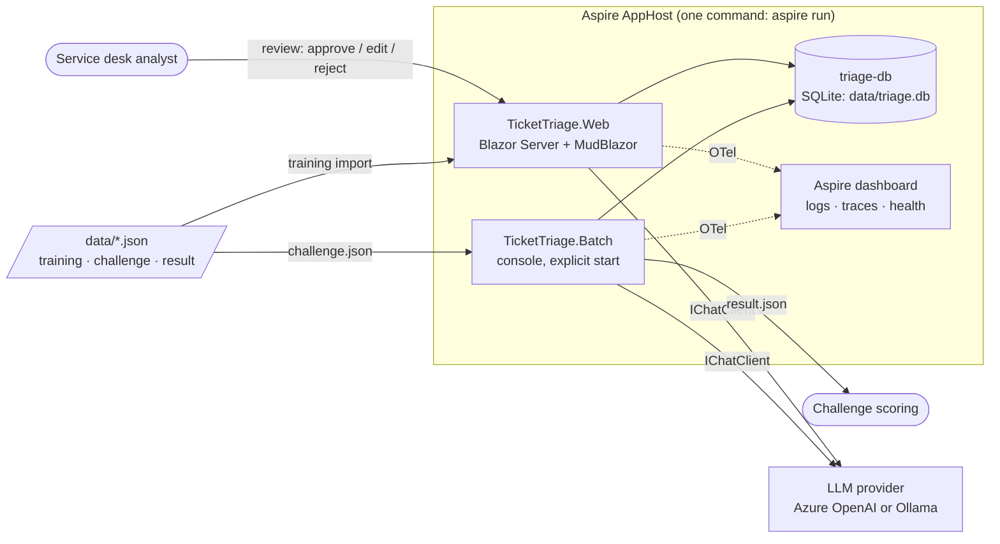
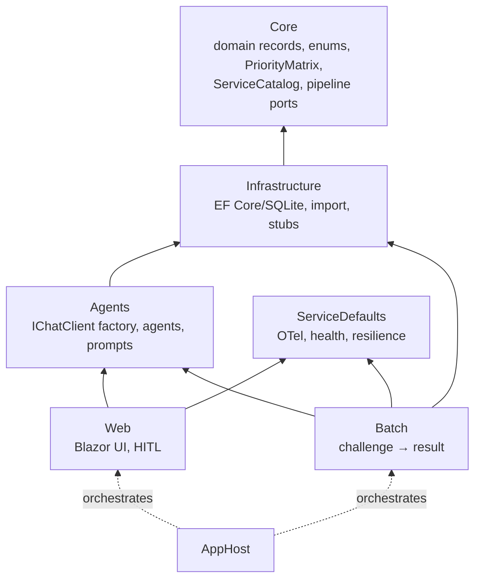
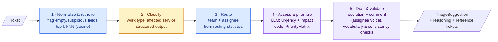
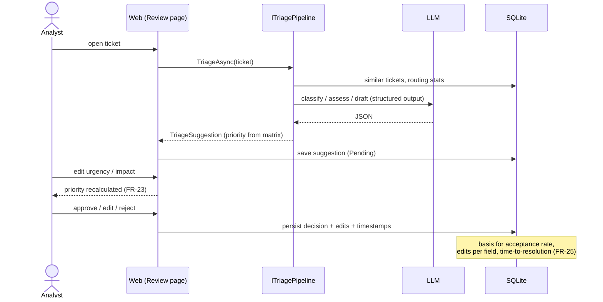

# Architecture

How TicketTriage is built and how a ticket flows through it. Requirements: [requirements.md](requirements.md). Why it's built this way: [adr/](adr/).

> Status legend: **implemented** = in code today, **planned** = required but still a stub (`TODO: implement`). Update this file when a stub is replaced.

## 1. System context

Web and Batch share **one** pipeline implementation (FR-31). The AppHost injects the connection string (`triage-db`) and the LLM configuration (`Llm__*`) from its user secrets.

## 2. Projects and dependencies

Core has no references, and all dependencies point inward. Pipeline steps are Core interfaces (`ISimilarTicketRetriever`, `ITicketClassifier`, `IRoutingResolver`, `IResolutionDrafter`, `ITriagePipeline`), implemented in Infrastructure (deterministic) or Agents (LLM-backed).

## 3. Data preparation (once, on startup — FR-01…05)

| Step | Status |
|---|---|
| Import | implemented (`TrainingDataImporter`) |
| Clean, embed, routing stats, filter | planned |

The training set's **Priority, Urgency and Impact are random**. They are never used as labels, as few-shot examples or in statistics.

## 4. Triage pipeline (per ticket)

The five steps are decided in [ADR-0001](adr/0001-hybrid-triage-pipeline.md). The colour shows who decides each value.

🟦 deterministic code · 🟨 LLM · 🟪 LLM proposes, code validates/decides

| Step | Core port | Decided by | Status |
|---|---|---|---|
| 1 Normalize & retrieve | `ISimilarTicketRetriever` | code (embeddings + cosine) | stub |
| 2 Classify | `ITicketClassifier` | LLM, validated against `ServiceCatalog` / enums | stub |
| 3 Route | `IRoutingResolver` | code (majority vote), LLM never invents names | stub |
| 4 Assess & prioritize | `ITicketClassifier` + `PriorityMatrix` | LLM (urgency, impact) → **code** (priority) | matrix implemented |
| 5 Draft & validate | `IResolutionDrafter` + validator | LLM draft from cleaned templates → code validation (FR-33) | stub |
| Orchestration | `ITriagePipeline` | code | stub |

## 5. Human in the loop

## 6. Cross-cutting

| Concern | Approach |
|---|---|
| Configuration | `Llm` section (`AzureOpenAI` \| `Ollama`), AppHost parameters → env vars, secrets in user secrets only |
| Observability | OpenTelemetry via ServiceDefaults. LLM calls (`Experimental.Microsoft.Extensions.AI`) show in the dashboard with token usage |
| Health | `/health`: `sqlite` + `agent-framework` (ready), `/alive` (live) |
| Reproducibility | temperature 0, fixed model deployment, prompt version logged (FR-32) |
| Security | ticket text is untrusted input (prompt injection), model output is validated and never rendered as raw HTML |
