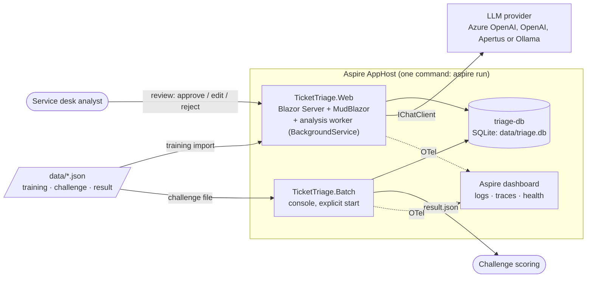
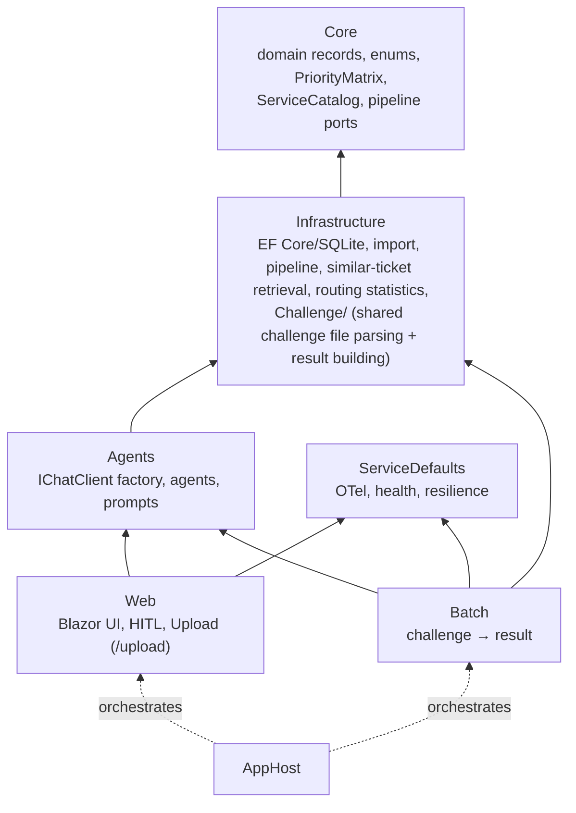
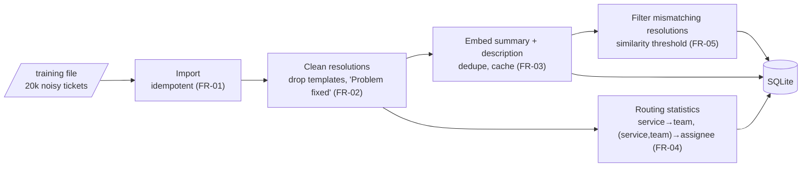
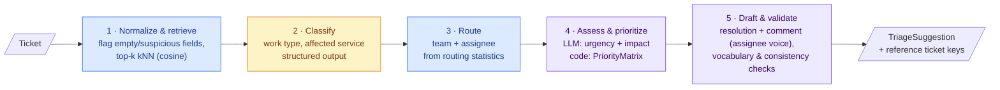
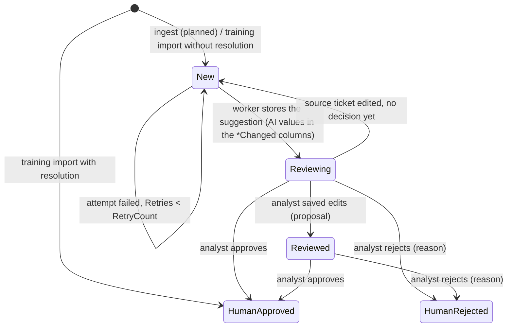
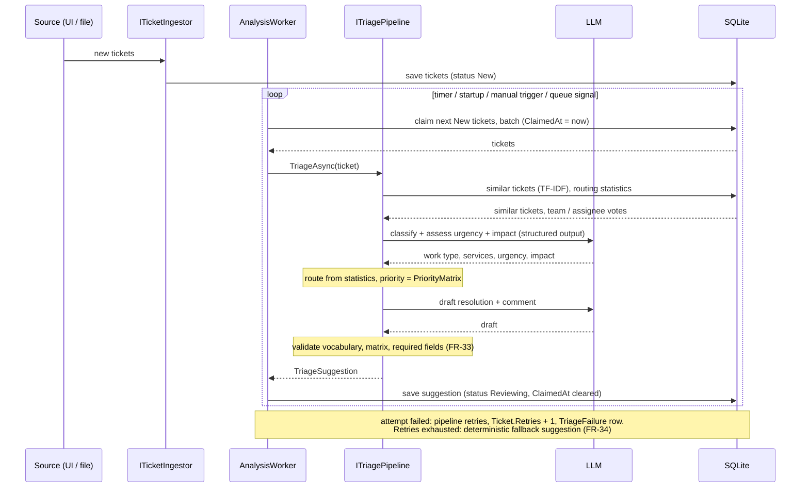
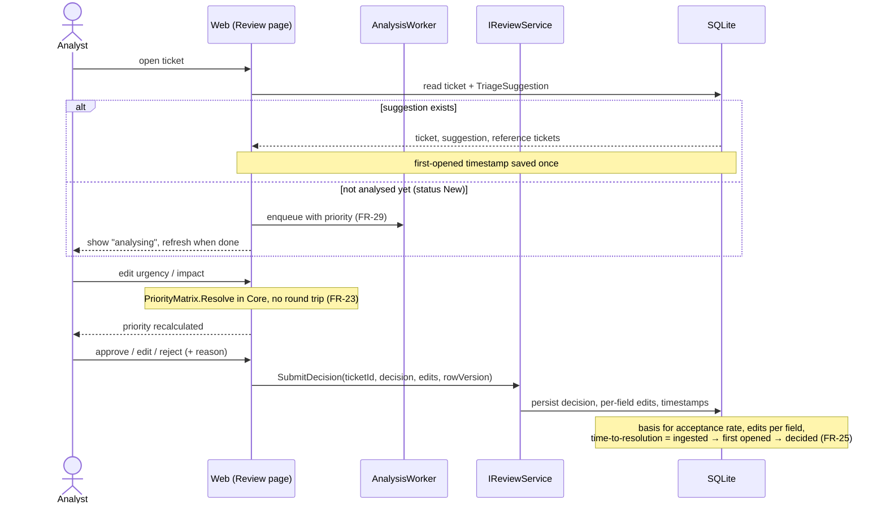
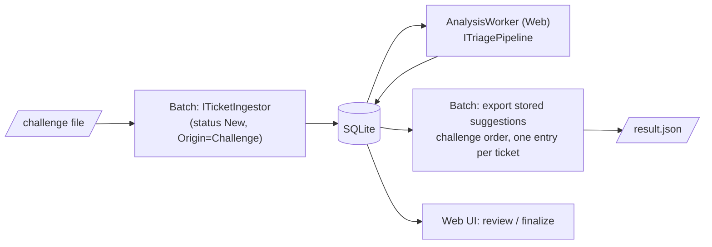

# Architecture

How TicketTriage is built and how a ticket flows through it. Requirements: [requirements.md](requirements.md). Why it's built this way: [adr/](adr/).

> Status legend: **implemented** = in code today, **planned** = required but still a stub (`TODO: implement`). Update this file when a stub is replaced. Pipeline orchestration, normalization, validation, retry and fallback are implemented ([features/triage-pipeline](features/triage-pipeline/README.md)); of the ports behind it, similar tickets ([features/similar-ticket-retrieval](features/similar-ticket-retrieval/README.md)), the ticket source and the LLM classifier and drafter ([features/triage-agent](features/triage-agent/README.md)) are implemented; routing (`StatisticsRoutingResolver`, majority vote from the training data) is implemented too; no stub remains. Ingest (`EfTicketIngestor`), the analysis worker (`AnalysisWorker`/`AnalysisCycle`/`TicketClaimStore`) and review persistence (`EfReviewService`) are implemented (§5) — the pre-computed, human-in-the-loop flow described there is current behaviour, not a plan. Batch (`BatchRunner`) and the Web upload page (`/upload`) both follow it end to end: ingest → analysis worker → export `result.json` from the stored suggestions ([features/batch-runner](features/batch-runner/README.md), §5.4); neither calls the LLM or the pipeline directly any more.

## 1. System context

All tickets share **one** pipeline implementation (FR-31). Batch has no LLM access of its own: it ingests the challenge tickets into `triage-db`, the analysis worker in Web analyses them like any ticket, and Batch exports `result.json` from the stored suggestions (§5.4). The AppHost injects the connection string (`triage-db`) and the LLM configuration (`Llm__*`, Web project only) from its user secrets.

## 2. Projects and dependencies

`Infrastructure/Challenge` (`ChallengeDocument`, `ChallengeResults`) holds the challenge-file logic shared by Batch (path wrapper `Batch/ChallengeFile`) and Web (`Web/Upload/ChallengeUploadService`), see [features/upload-frontend](features/upload-frontend/README.md). Tests: `tests/TicketTriage.Web.Tests` covers the upload service.

Core has no references, and all dependencies point inward. Pipeline steps are Core interfaces (`ITicketSource`, `ISimilarTicketSource`, `ITicketClassifier`, `IRoutingResolver`, `IResolutionDrafter`, `ITriageFailureStore`, `ITriagePipeline`), implemented in Infrastructure (deterministic) or Agents (LLM-backed). `ITriagePipeline` only **analyses** tickets, as a stream (`TriageAsync(IAsyncEnumerable<Ticket>)`, one suggestion per ticket, in order) or for a single ticket. `ITicketSource` supplies the input stream (`DbTicketSource`, no caller yet). Two further Core ports keep the other concerns out of it: `ITicketIngestor` (saves incoming tickets as `New`) and `IReviewService` (persists the analyst's decision, edits and timestamps). The analysis worker is a `BackgroundService` in Web that calls the pipeline, see [ADR-0002](adr/0002-background-analysis-worker.md).

## 3. Data preparation (once, on startup — FR-01…05)

| Step | Status |
|---|---|
| Import | implemented (`TrainingDataImporter`) |
| Routing stats (in memory, `RoutingStatisticsProvider`) | implemented |
| Clean, embed, filter | planned |

The training set's **Priority, Urgency and Impact are random**. They are never used as labels, as few-shot examples or in statistics.

**Embedding throttle (proposal).** Embedding 20k tickets is a one-off bulk job and must not hit provider rate limits (429):

- Send the texts in batches (e.g. 64 inputs per request), with at most 2 requests in flight.
- Retry on 429 and 5xx with exponential backoff and jitter, and honour `Retry-After`.
- Save the vectors after every batch and embed only tickets that have no vector yet (keyed by a hash of the text). An interrupted or repeated import resumes where it stopped and costs nothing extra.
- Set the "data ready" marker only when every training ticket has a vector.
- The cost is small (a few million tokens with a small embedding model). Ollama is the free fallback for local runs.

## 4. Triage pipeline (per ticket)

The five steps are decided in [ADR-0001](adr/0001-hybrid-triage-pipeline.md). The colour shows who decides each value.

🟦 deterministic code · 🟨 LLM · 🟪 LLM proposes, code validates/decides

| Step | Core port | Decided by | Status |
|---|---|---|---|
| 1 Normalize & retrieve | `TicketNormalizer` (implemented) + `ISimilarTicketSource` | code (TF-IDF + cosine kNN over `Description`, in memory) | normalize and `DbSimilarTicketSource` implemented ([features/similar-ticket-retrieval](features/similar-ticket-retrieval/README.md)); no embeddings / BM25 |
| 2 Classify | `ITicketClassifier` | LLM, validated against the service catalog (`IServiceCatalogProvider`) / enums | implemented (`LlmTicketClassifier`); `ServiceCatalog` holds the 20 real names |
| 3 Route | `IRoutingResolver` | code (majority vote over `RoutingStatistics`, ties alphabetical), LLM never invents names | implemented (`StatisticsRoutingResolver`; statistics built once per process, no schema change) |
| 4 Assess & prioritize | `ITicketClassifier` + `PriorityMatrix` | LLM (urgency, impact) → **code** (priority) | implemented (urgency + impact come from the same LLM call as step 2; matrix in Core) |
| 5 Draft & validate | `IResolutionDrafter` + `SuggestionValidator` | LLM draft from cleaned templates → code validation (FR-33) | drafter implemented (`LlmResolutionDrafter`, prompt `drafter-v2`): the Core port `DraftAsync(ticket, classification, routing, similar)` returns `ResolutionDraft(Status, Comment)`; the pipeline sets `TriageSuggestion.ResolutionStatus` and `TriageResult.Resolution` writes it in the lowercase export vocabulary (`done`, `cancelled`, `clarification`, `cannot reproduce`). An unknown model status throws, so retry and fallback apply; the fallback status is the majority of the similar tickets' statuses (ties: summed score, then enum order), else `done`. Validator checks all 7 fields (FR-33): enums, canonical `ServiceCatalog` names, team and assignee equal to the routing statistics for the first service (none for an unknown service), priority = matrix, resolution status, comment. The fallback takes its routing from the same statistics, so it is always consistent |
| Orchestration | `ITriagePipeline` (analysis only, stream) | code: sequential, timeout, retry, failure log, fallback (FR-34…36) | implemented |
| Input stream | `ITicketSource` | code | `DbTicketSource` implemented (streams `New` tickets from SQLite), registered in DI, no caller yet |
| Failure log | `ITriageFailureStore` (`EfTriageFailureStore`) | code, `Ticket.Retries` + table `TriageFailure` | implemented |
| Ingest | `ITicketIngestor` (`EfTicketIngestor`) | code, saves tickets as `New`; also used by Batch (challenge tickets, §5.4) | implemented |
| Analysis worker | `BackgroundService` in Web (`AnalysisWorker`/`AnalysisCycle`/`TicketClaimStore`) | code, claims `New` tickets from the ingest path (lease `ClaimedAt`) and calls the pipeline (ADR-0002, §5); also serves Batch (§5.4) | implemented |
| Review persistence | `IReviewService` (`EfReviewService`) | code, decision + per-field edits + timestamps, optimistic concurrency on `Ticket.Version` | implemented |
| Batch export from DB | `BatchRunner` | code, ingests challenge tickets, waits for the worker and writes `result.json` from stored suggestions (§5.4) | implemented |

### 4.1 Pipeline rules

> There are no confidence values, no `LowConfidence` flag and no per-decision reasoning (decision: not needed, FR-18 dropped). The suggestion only carries the keys of the reference tickets (FR-17).
>
> **Seven output fields.** The scored fields are work type, affected service, service team(s), assignee, priority, resolution status and resolution comment (requirements §2). Validation (FR-33) has to cover all seven. **Resolution status is implemented**: the drafter returns it together with the comment (voice = the routed assignee, neutral when none), the pipeline stores it in `TriageSuggestion.ResolutionStatus`, `TriageResult.Resolution` emits it. The training statuses carry no signal (measured, [score-completeness](features/score-completeness/README.md)), so the prompt makes the model decide from the ticket's own text and never from similar tickets' statuses. The `SuggestionValidator` checks all seven fields (slice 4), see the validation table in the [triage-pipeline README](features/triage-pipeline/README.md).

| Topic | Rule |
|---|---|
| **No self-retrieval** | `ISimilarTicketSource.FindSimilarAsync(ticket, top, ct)` receives the ticket under analysis and excludes it from the kNN result. This matters when a challenge ticket also appears in the training file, and for tickets that are re-analysed. |
| **Language** | The language is detected once per ticket. The drafted resolution and comment use that language, and the validator checks against it. Service, team and enum names stay in the fixed English vocabulary of the catalog. |
| **Multiple services** | Open: it is not yet confirmed that a ticket can have more than one service (requirements §7 no. 5). The field is a list in the export, so the model keeps a list. Urgency, impact and priority are assessed once per ticket. Until the data is checked, routing uses the first service the classifier lists, and all listed services are shown as affected. If several services do occur and map to different teams, a proper rule is needed. The rule "service with the highest ticket priority" was considered and dropped for now, because it needs urgency and impact per service. |
| **Cold start and ties** | With few or no similar tickets, or a tie in the majority vote, the suggestion is still produced (fallback values where nothing better exists) and the analyst decides. No flag and no further tie-break logic for now. |
| **Text length** | The importer truncates imported text (summary 250, description 1000, assignee 50, resolution 500, comment 500 characters). The retrieval tokenizer caps text at 20 000 characters. No truncation or chunking in the pipeline. |
| **Reference tickets** | Similar tickets and their resolutions come from our own cleaned and controlled training data (FR-02, FR-05), so they are trusted. Only the incoming ticket text is treated as untrusted input. |

## 5. Ticket lifecycle and human in the loop

Suggestions are **pre-computed** by a background worker. Opening a ticket only reads the stored result ([ADR-0002](adr/0002-background-analysis-worker.md)).

> **Status: implemented.** `ITicketIngestor` (`EfTicketIngestor`), the analysis worker (`AnalysisWorker`/`AnalysisCycle`/`TicketClaimStore`) and `IReviewService` (`EfReviewService`) all exist in code and are wired up in `TicketTriage.Web/Program.cs`. This section describes current behaviour on top of the DB status model, not a plan.

### 5.1 Ticket states

The states are the rows of the `Status` lookup table (seeded in `TriageDbContext`): `New`, `Reviewing`, `Reviewed`, `HumanRejected`, `HumanApproved`. There is no `Analysing` and no `Failed` status; "in analysis" and "failed" are derived, see below.

| Status | Meaning | Implementation |
|---|---|---|
| `New` | Ticket has no stored suggestion yet. Input of the worker (`TicketClaimStore`). While the worker holds it, the nullable `ClaimedAt` lease marks it as "in analysis". | implemented |
| `Reviewing` | A suggestion is stored (also a fallback suggestion, see §5.2.2) and waits for the analyst. | implemented |
| `Reviewed` | The analyst saved edits (`EfReviewService.SaveEditsAsync`) but has not approved or rejected yet. | implemented |
| `HumanApproved` / `HumanRejected` | Final decision (FR-22). Approved with or without edits, told apart by the per-field edits. Imported training tickets that have a resolution are `HumanApproved`. | implemented (`EfReviewService.ApproveAsync`/`RejectAsync`), import implemented |

The ticket list (FR-20) shows `New` as "analysing" (or "queued"), and a `New` ticket whose `Retries` reached `Triage:RetryCount` as "failed". A failed ticket still shows the deterministic fallback values (FR-34). `HumanApproved` and `HumanRejected` are final. Re-opening, un-rejecting and re-analysis after a decision are out of scope (§7); a failed ticket can be requeued (`EfReviewService.RequeueFailedAsync`, resets `Retries`/`ClaimedAt`, status back to `New`).

> **Known risk, resolved.** Imported training tickets without a resolution also have status `New`. `TicketClaimStore.ClaimAsync` filters `Origin != TicketOrigin.Training`, so the worker only ever claims ingested tickets (Web upload / Batch, `TicketOrigin.Challenge`), never training history.

### 5.2 Ingest and analysis (worker)

### 5.2.1 Worker rules

These rules close the gaps of the diagram above. All of them apply to the worker (implemented, `TicketClaimStore` + `AnalysisCycle`). Challenge tickets go through the same worker, so these rules apply to them too; the export rules of §5.4 come on top.

| Rule | Definition |
|---|---|
| **Start gate** | The worker starts claiming only after data preparation (import, embeddings, routing statistics, §3) has completed. A persisted "data ready" marker tells it. Until then ingest still saves tickets as `New`, they wait. Without this gate, retrieval would run on a half-imported set. |
| **Atomic claim** | A claim is one conditional statement, `UPDATE Tickets SET ClaimedAt=@now WHERE Id IN (…) AND StatusId=<New> AND ClaimedAt IS NULL`, followed by a read of the rows that were changed. Two overlapping ticks or two instances can never claim the same ticket, because SQLite has a single writer. The transaction covers only the claim and is never held across an LLM call. |
| **Lease and sweep** | `ClaimedAt` is the lease. On startup and on every tick, `New` tickets with `ClaimedAt` older than the lease (assumption: 5 min, above the per-ticket timeout) are released (`ClaimedAt = NULL`). This recovers tickets after a crash or a restart. |
| **Per-ticket timeout** | Done by the pipeline: each attempt runs under `Triage:TicketTimeoutSeconds` (60 s), on top of the resilience timeouts per LLM call. |
| **Failure isolation** | Tickets of a batch are processed independently. An exception or timeout affects only its own ticket and never the rest of the batch or the worker loop. |
| **Incomplete call** | Handled by the pipeline: a failed attempt (LLM error, timeout, validation failure) is retried up to `Triage:RetryCount` and logged (`TriageFailure`, `Ticket.Retries`). There are no partial suggestions. |
| **Reviewing is closed to the worker** | The worker only claims `New`. A ticket in `Reviewing` or later is never re-analysed and its suggestion is never overwritten, so it cannot change while an analyst edits it. The row-version check of §5.3 still protects against two analysts. |
| **Source edit** | If a ticket is changed in the source (a re-ingest with the same key) and it has no final decision yet, its suggestion is dropped and the status goes back to `New`. A decided ticket (`HumanApproved`, `HumanRejected`) is not changed. Edits made directly in the database are out of scope. |
| **Ingest = upsert** | `ITicketIngestor` upserts on the Jira key. It never creates a duplicate row. An unchanged re-send is a no-op. (The DB has no Jira key column yet.) |

### 5.2.2 One retry model (decision)

There is a single retry mechanism: the **pipeline's**. The worker adds no counter of its own.

| | Pipeline (implemented) | Worker (implemented) |
|---|---|---|
| Counter | `Ticket.Retries`, reset to 0 on success | none (the worker does not count attempts) |
| Limit | `Triage:RetryCount` | – |
| On exhaustion | deterministic fallback suggestion is returned | worker stores it like any suggestion (`Reviewing`). The ticket is shown as "failed" because `Retries >= RetryCount` |
| Failure record | table `TriageFailure` (reason, frames) | – |
| Timeout | `Triage:TicketTimeoutSeconds` per attempt | lease `ClaimedAt` only guards against crashes |

Consequences: no `Attempts` column and no `Failed` status. A manual re-queue of a failed ticket means resetting `Retries` to 0 and the status to `New` (planned, not designed). Details of the pipeline side: [features/triage-pipeline](features/triage-pipeline/README.md).

### 5.3 Open and review

If the ticket changed in the meantime (another analyst decided, or the worker re-analysed it), `rowVersion` no longer matches, the write is rejected and the UI reloads. Implemented via `Ticket.Version` (optimistic concurrency, bumped by both `TicketClaimStore.SaveAsync` and `EfReviewService`), not a dedicated EF concurrency token column.

### 5.4 Batch (challenge submission)

**Implemented (decided 2026-09-25).** The 20 challenge tickets take the same path as any ticket, so they also appear in the Web UI and a human can review and finalize them there:

- `BatchRunner` no longer calls `ITriagePipeline` or the LLM itself. Analysis, retry, timeout, fallback and the FR-33 validation are done by the worker path (§5.2, §5.2.1); Batch only ingests, waits and exports.
- `result.json` has the same `TriageResult` shape, one entry per challenge ticket in challenge order, built from the **stored** suggestions (`ChallengeResults.BuildAsync`).
- Challenge tickets are distinguishable from imported training history via `Ticket.Origin = TicketOrigin.Challenge` (Web upload uses the same origin); the worker's `TicketClaimStore` claims only `Origin != Training` (§5.1 known risk, resolved).
- The worker runs in Web only. Batch never hosts it (ADR alternative "Worker inside Batch" stays rejected). `BatchRunner` polls `IAnalysisMonitor` and throws `BatchWorkerUnavailableException` if the worker's heartbeat is stale beyond `WorkerStartGraceSeconds` — Web (`aspire run`) must be running first.

**Resolved assumptions** (were open, requirements §7 no. 9 to 12):

| Topic | Resolution |
|---|---|
| Trigger and wait | `BatchRunner.WaitForAnalysisAsync` polls (`PollIntervalSeconds`) until every ticket has left `New`, up to `WaitTimeoutSeconds`; it also watches the worker heartbeat and fails fast if the worker isn't running. |
| Ticket still `New` after the timeout, or failed | Exported with the deterministic fallback suggestion (FR-34), same as any unanalysed ticket (`ChallengeResults.BuildAsync`). |
| What is exported | The **AI suggestion** as stored by the worker (`SuggestionMapper.ToDomain`) — analyst edits/decisions are not applied to the export. No switch to export the analyst's final values exists. |
| Single SQLite writer | Not a conflict: Batch never analyses, it only ingests (writes) and reads suggestions; the worker in Web is the only writer of suggestions. SQLite WAL mode is enabled in every environment so both processes can run concurrently (`Program.cs`). |

**Second entry point: Web upload (implemented).** `/upload` in Web follows the same ingest → worker → export path with `TicketOrigin.Challenge`: the page parses the file, ingests via `ITicketIngestor`, polls `IAnalysisMonitor` while the Web `AnalysisWorker` analyses (30 s cycles, batch of 5, so minutes for 20 tickets), and builds `result.json` from the stored suggestions (pending tickets use the fallback). Output is byte-identical to Batch's (shared `ChallengeDocument.WriteAsync`); caps 10 MB / 500 records. Details, options and limitations: [features/upload-frontend](features/upload-frontend/README.md).

**Challenge ticket identity.** Ingest upserts by `(Origin, SourceKey)` (unique index). A record's `Issue key` is its `SourceKey` when present; real challenge files are keyless, so `ChallengeDocument` assigns a **content key**: `#` + the first 16 hex characters of the SHA-256 of the record JSON (`ChallengeDocument.ContentKey`). Consequences:

- Uploading or re-running the **same file** yields the same keys → `Unchanged`, the stored analysis is reused.
- A **different file** yields different keys → new rows; it never overwrites tickets of an earlier upload (positional `#n` keys used to).
- **Identical records** (in one file or across files) share one row and one analysis; both output positions get the same suggestion.
- The position `#n` (`ChallengeDocument.PositionalKey`) is display only. The UI shows stored tickets as `DB-{Id}`; the content key is never written to `result.json`.

**Batch per-run rules:**

- **Every ticket is evaluated.** `result.json` always contains one entry per challenge ticket, in input order. A ticket that stays pending or fails does not stop the run.
- **No self-retrieval.** kNN excludes the ticket itself (see §4.1). This holds for every path into the pipeline.
- Bad input, an unwritable output path or an aborted run exits with a non-zero code and writes nothing; the file is written atomically (temp file + move), so it is never partial. Details: [features/batch-runner](features/batch-runner/README.md).

## 6. Cross-cutting

| Concern | Approach |
|---|---|
| Configuration | `Llm` section (`AzureOpenAI` \| `OpenAI` \| `Apertus` \| `Ollama`), AppHost parameters → env vars, secrets in user secrets only. `Triage` section (retry, timeout, stop switch) in appsettings |
| Observability | OpenTelemetry via ServiceDefaults. LLM calls (`Experimental.Microsoft.Extensions.AI`) show in the dashboard with token usage. Timing logs (no ticket text): per LLM call (`LlmCallLog`: ms, prompt chars, input/cached/output/reasoning tokens), per ticket (`TriagePipeline`: per-step ms; `AnalysisCycle`: queue wait since ingest, pipeline, save), per cycle, and upload parse/ingest/export. Step and housekeeping lines are Debug, enabled in Web `appsettings.Development.json` |
| Health | `/health`: `sqlite` + `agent-framework` (ready), `/alive` (live) |
| Reproducibility | temperature 0, fixed model deployment, prompt version logged (FR-32) |
| Security | ticket text is untrusted input (prompt injection), model output is validated and never rendered as raw HTML |

## 7. Known limitations (out of scope)

Decided as out of scope for the hackathon. Recorded so they are not mistaken for oversights.

| Topic | Current behaviour |
|---|---|
| Reopen, un-reject, re-analyse after a decision | Not supported. Decisions are final. |
| Embedding model change | No model/version key on vectors. A model change means a full re-import. |
| Rare services, ties in routing | The analyst decides. No tie-break, no flag. |
| Inactive team or assignee | Routing statistics come from history and may name someone who has left. Not checked. |
| Duplicate tickets | Similar tickets are shown as references. No duplicate detection or linking. |
| Direct database edits | A ticket edited in the database (not through ingest) does not invalidate its suggestion. |
| Personal data | No PII redaction, retention or region rules beyond the log hygiene of CLAUDE.md. |
| Non-determinism | Temperature 0 does not guarantee identical output on Azure OpenAI. Not handled. |
| Upload page (`/upload`) | No authentication (local / hackathon only). No global pending check, so a second tab can upload while earlier tickets are pending. No per-field length caps on ticket text. A changed record with a real `Issue key` that is already reviewed is Locked and exports its earlier reviewed suggestion (the page warns). See [features/upload-frontend](features/upload-frontend/README.md). |
| UI and review details | Merge of concurrent edits, first-opened timing bias, circuit reconnect and analyst identity are not designed yet. |
