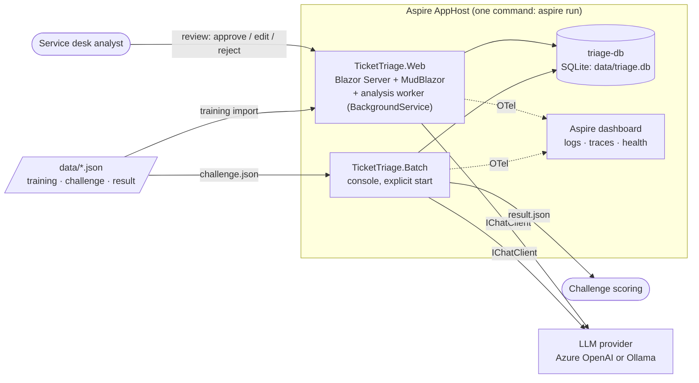
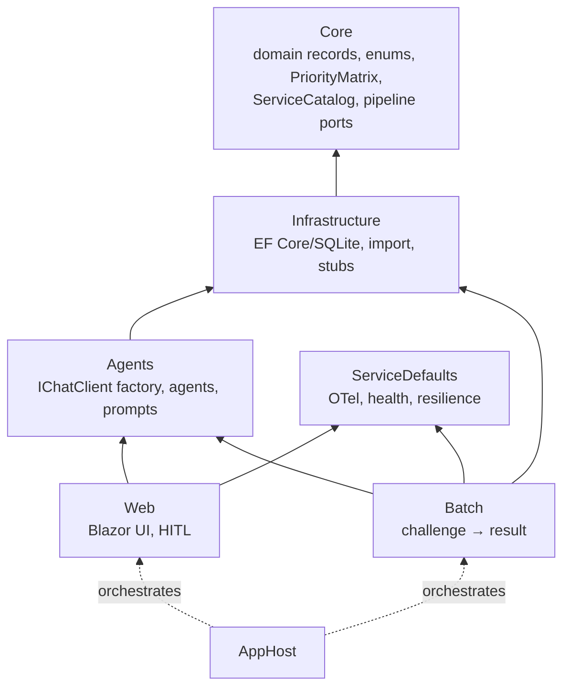
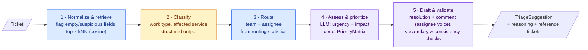
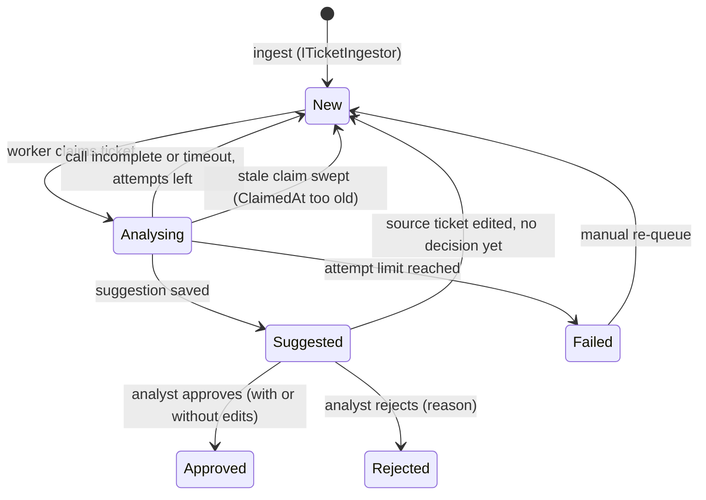
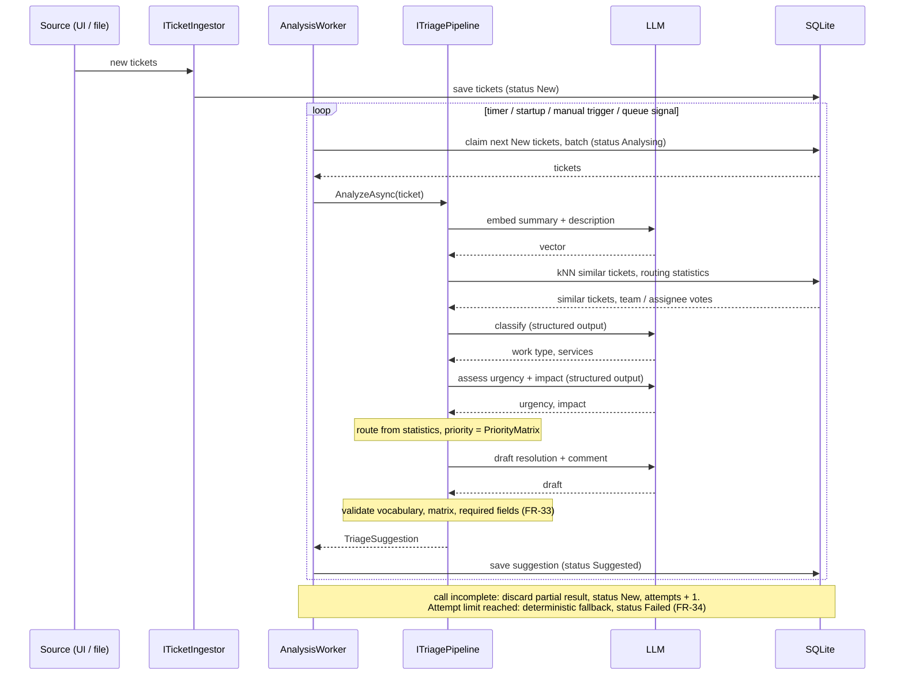
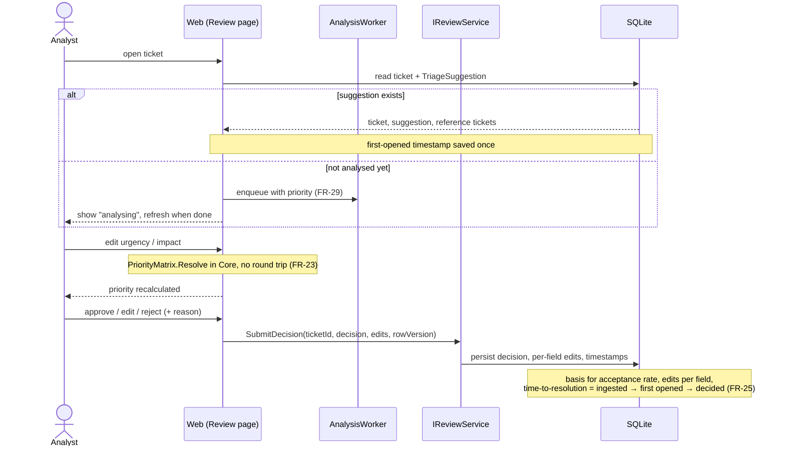

# Architecture

How TicketTriage is built and how a ticket flows through it. Requirements: [requirements.md](requirements.md). Why it's built this way: [adr/](adr/).

> Status legend: **implemented** = in code today, **planned** = required but still a stub (`TODO: implement`). Update this file when a stub is replaced.

## 1. System context

Web (UI and analysis worker) and Batch share **one** pipeline implementation (FR-31). The AppHost injects the connection string (`triage-db`) and the LLM configuration (`Llm__*`) from its user secrets.

## 2. Projects and dependencies

Core has no references, and all dependencies point inward. Pipeline steps are Core interfaces (`ISimilarTicketRetriever`, `ITicketClassifier`, `IRoutingResolver`, `IResolutionDrafter`, `ITriagePipeline`), implemented in Infrastructure (deterministic) or Agents (LLM-backed). `ITriagePipeline` only **analyses** a ticket. Two further Core ports keep the other concerns out of it: `ITicketIngestor` (saves incoming tickets as `New`) and `IReviewService` (persists the analyst's decision, edits and timestamps). The analysis worker is a `BackgroundService` in Web that calls the pipeline, see [ADR-0002](adr/0002-background-analysis-worker.md).

## 3. Data preparation (once, on startup — FR-01…05)

| Step | Status |
|---|---|
| Import | implemented (`TrainingDataImporter`) |
| Clean, embed, routing stats, filter | planned |

The training set's **Priority, Urgency and Impact are random**. They are never used as labels, as few-shot examples or in statistics.

**Embedding throttle (proposal).** Embedding 20k tickets is a one-off bulk job and must not hit provider rate limits (429):

- Send the texts in batches (e.g. 64 inputs per request), with at most 2 requests in flight.
- Retry on 429 and 5xx with exponential backoff and jitter, and honour `Retry-After`.
- Save the vectors after every batch and embed only tickets that have no vector yet (keyed by a hash of the text). An interrupted or repeated import resumes where it stopped and costs nothing extra.
- Set the "data ready" marker only when every training ticket has a vector.
- The cost is small (a few million tokens with a small embedding model). Ollama is the free fallback for local runs.

## 4. Triage pipeline (per ticket)

The five steps are decided in [ADR-0001](adr/0001-hybrid-triage-pipeline.md). The colour shows who decides each value.

🟦 deterministic code · 🟨 LLM · 🟪 LLM proposes, code validates/decides

| Step | Core port | Decided by | Status |
|---|---|---|---|
| 1 Normalize & retrieve | `ISimilarTicketRetriever` | code (embeddings + cosine) | stub |
| 2 Classify | `ITicketClassifier` | LLM, validated against `ServiceCatalog` / enums | stub |
| 3 Route | `IRoutingResolver` | code (majority vote), LLM never invents names | stub |
| 4 Assess & prioritize | `ITicketClassifier` + `PriorityMatrix` | LLM (urgency, impact) → **code** (priority) | matrix implemented |
| 5 Draft & validate | `IResolutionDrafter` + validator | LLM draft from cleaned templates → code validation (FR-33) | stub |
| Orchestration | `ITriagePipeline` (analysis only) | code | stub |
| Ingest | `ITicketIngestor` | code, saves tickets as `New` | planned |
| Analysis worker | `BackgroundService` in Web | code, claims `New` tickets and calls the pipeline (ADR-0002) | planned |
| Review persistence | `IReviewService` | code, decision + per-field edits + timestamps | planned |

### 4.1 Pipeline rules

| Topic | Rule |
|---|---|
| **No self-retrieval** | `ISimilarTicketRetriever` takes the id of the ticket under analysis and excludes it from the kNN result. This matters when a challenge ticket also appears in `training.json`, and for tickets that are re-analysed. |
| **Confidence** | If the pipeline cannot complete a ticket with high confidence (empty or garbage text, unclear classification, no usable references), the suggestion is flagged `LowConfidence` with a reason. The UI shows the flag and the reason to the analyst, who decides. The LLM is not skipped silently and nothing is auto-routed. |
| **Language** | The language is detected once per ticket. The drafted resolution and comment use that language, and the validator checks against it. Service, team and enum names stay in the fixed English vocabulary of the catalog. |
| **Multiple services** | Open: it is not yet confirmed that a ticket can have more than one service (requirements §7 no. 5). The field is a list in the export, so the model keeps a list. Urgency, impact and priority are assessed once per ticket. Until the data is checked, routing uses the first service the classifier lists, and all listed services are shown as affected. If several services do occur and map to different teams, a proper rule is needed. The rule "service with the highest ticket priority" was considered and dropped for now, because it needs urgency and impact per service. |
| **Cold start and ties** | With few or no similar tickets, or a tie in the majority vote, the suggestion is flagged `LowConfidence` and the analyst chooses. No further tie-break logic for now. |
| **Text length** | Ticket text is limited by the database column (`varchar(max)`). No truncation or chunking in the pipeline. |
| **Reference tickets** | Similar tickets and their resolutions come from our own cleaned and controlled training data (FR-02, FR-05), so they are trusted. Only the incoming ticket text is treated as untrusted input. |

## 5. Ticket lifecycle and human in the loop

Suggestions are **pre-computed** by a background worker. Opening a ticket only reads the stored result ([ADR-0002](adr/0002-background-analysis-worker.md)).

### 5.1 Ticket states

`New`, `Analysing` and `Failed` show in the ticket list as "analysing" / "failed" (FR-20). A `Failed` ticket still shows deterministic fallback values where there are any (FR-34).

`Approved` and `Rejected` are final. There is no `Edited` state: the analyst either approves or rejects, and any changes made before approving are stored as per-field edits on the decision (FR-25), so "approved unchanged" and "approved with edits" are told apart by those edits. Re-opening or un-rejecting a decided ticket, and re-analysis after a decision, are out of scope (see §7).

### 5.2 Ingest and analysis (worker)

### 5.2.1 Worker rules

These rules close the gaps of the diagram above. All of them apply to the worker. Batch follows the per-ticket rules of §5.4.

| Rule | Definition |
|---|---|
| **Start gate** | The worker starts claiming only after data preparation (import, embeddings, routing statistics, §3) has completed. A persisted "data ready" marker tells it. Until then ingest still saves tickets as `New`, they wait. Without this gate, kNN would run on a half-imported or half-embedded set. |
| **Atomic claim** | A claim is one conditional statement, `UPDATE Tickets SET Status='Analysing', ClaimedAt=@now, Attempts=Attempts+1 WHERE Id IN (…) AND Status='New'`, followed by a read of the rows that were changed. Two overlapping ticks or two instances can never claim the same ticket, because SQLite has a single writer. The transaction covers only the claim and is never held across an LLM call. |
| **Lease and sweep** | `ClaimedAt` is the lease. On startup and on every tick, tickets in `Analysing` with `ClaimedAt` older than the lease (assumption: 5 min, above the per-ticket timeout) are reset to `New`. This recovers tickets after a crash or a restart. |
| **Per-ticket timeout** | Each ticket runs under its own `CancellationTokenSource` (assumption: 60 s in total, on top of the resilience timeouts per LLM call). A slow ticket is cancelled and handled like any incomplete call. |
| **Failure isolation** | Tickets of a batch are processed independently. An exception or timeout affects only its own ticket and never the rest of the batch or the worker loop. |
| **Incomplete call** | If any pipeline step does not complete (LLM error, timeout, cancellation, validation failure), the partial result is **discarded**, not stored. The ticket goes back to `New` so the next load tries it again. There are no partial suggestions. `Attempts` is kept, so a ticket that keeps failing ends as `Failed` at the limit (FR-34) and does not retry forever. |
| **Suggested is closed to the worker** | The worker only claims `New`. A ticket in `Suggested` is never re-analysed and its suggestion is never overwritten, so it cannot change while an analyst edits it. The `rowVersion` check of §5.3 still protects against two analysts. |
| **Source edit** | If a ticket is changed in the source (a re-ingest with the same key) and it has no decision yet, its suggestion is dropped and the status goes back to `New`. A decided ticket (`Approved`, `Rejected`) is not changed. Edits made directly in the database are out of scope. |
| **Ingest = upsert** | `ITicketIngestor` upserts on the Jira key. It never creates a duplicate row. An unchanged re-send is a no-op. |

### 5.3 Open and review

If the ticket changed in the meantime (another analyst decided, or the worker re-analysed it), `rowVersion` no longer matches, the write is rejected and the UI reloads.

### 5.4 Batch (challenge submission)

Batch does not use the worker. It calls `ITriagePipeline` directly for each challenge ticket, runs the FR-33 validation and writes `result.json`. The pipeline code is the same as in 5.2.

- **Every ticket is evaluated.** `result.json` always contains one entry per challenge ticket. The status is kept per ticket, not per run. A ticket that fails does not stop the run.
- **Per-ticket retry, then fallback.** Batch has no worker, so it retries an incomplete ticket itself (same attempt limit and per-ticket timeout as §5.2.1). If it still fails, the deterministic fallback of FR-34 fills the entry and the ticket is reported as failed in the console summary. The file is never partial.
- **No self-retrieval.** kNN excludes the ticket itself (see §4.1).
- **Data ready.** Batch checks the same "data ready" marker as the worker and stops with a clear message if data preparation is not complete.

## 6. Cross-cutting

| Concern | Approach |
|---|---|
| Configuration | `Llm` section (`AzureOpenAI` \| `Ollama`), AppHost parameters → env vars, secrets in user secrets only |
| Observability | OpenTelemetry via ServiceDefaults. LLM calls (`Experimental.Microsoft.Extensions.AI`) show in the dashboard with token usage |
| Health | `/health`: `sqlite` + `agent-framework` (ready), `/alive` (live) |
| Reproducibility | temperature 0, fixed model deployment, prompt version logged (FR-32) |
| Security | ticket text is untrusted input (prompt injection), model output is validated and never rendered as raw HTML |

## 7. Known limitations (out of scope)

Decided as out of scope for the hackathon. Recorded so they are not mistaken for oversights.

| Topic | Current behaviour |
|---|---|
| Reopen, un-reject, re-analyse after a decision | Not supported. Decisions are final. |
| Embedding model change | No model/version key on vectors. A model change means a full re-import. |
| Rare services, ties in routing | Treated as `LowConfidence`, the analyst decides. No tie-break. |
| Inactive team or assignee | Routing statistics come from history and may name someone who has left. Not checked. |
| Duplicate tickets | Similar tickets are shown as references. No duplicate detection or linking. |
| Direct database edits | A ticket edited in the database (not through ingest) does not invalidate its suggestion. |
| Personal data | No PII redaction, retention or region rules beyond the log hygiene of CLAUDE.md. |
| Non-determinism | Temperature 0 does not guarantee identical output on Azure OpenAI. Not handled. |
| UI and review details | Merge of concurrent edits, first-opened timing bias, circuit reconnect and analyst identity are not designed yet. |
