# Batch runner

**Date**: 2026-09-25 · **Projects**: Batch / Core

Requirements: [requirements.md](requirements.md) · plan: [plan.md](plan.md)

## Summary

`TicketTriage.Batch` reads the challenge tickets, triages each one through `ITriagePipeline` and writes `result.json` for scoring. It is the only path that produces the file the challenge scores. This direct pipeline call is **transitional** (see [Planned change](#planned-change-batch-via-worker)).

## How it works

```mermaid
flowchart LR
    A[Program: options + host] --> B[BatchCommand.ExecuteAsync]
    B --> C[BatchRunner.Prepare]
    C --> D[beforeRunAsync: DB init, Development only]
    D --> E[BatchRunner.RunAsync]
    E --> F[read + validate input]
    F --> G[ITriagePipeline.TriageAsync]
    G --> H[TriageResult.From per suggestion]
    H --> I[temp file + move to result.json]
```



| Step | Behaviour |
|---|---|
| Options | `--input` / `--output` map to `Batch:Input` / `Batch:Output`; both validated (missing → exit 2) |
| `Prepare()` preflight | Resolves full paths, rejects input == output (`BatchInputException`), creates the output directory and probes writability with a temp file. Runs before any DB work or LLM call, so a bad output path fails fast (exit 1) |
| `beforeRunAsync` | Optional callback of `BatchCommand.ExecuteAsync`. `Program` passes `InitializeTriageDatabaseAsync` in Development only, and only after `Prepare()` succeeded: a missing `--input` exits 2 without touching the DB |
| Read input | `ChallengeDocument.ReadAsync`: a JSON array of records or an envelope object with a `records` array (the real export). Records without `Issue key` get an internal content key (`#` + 16 hex of the record's SHA-256, see architecture §5 "Challenge ticket identity"). Missing file, bad JSON, missing/non-array/empty `records`, non-object or null record, unusable record → `BatchInputException`. Messages carry index, position and path only, never input fragments |
| Pipeline | Sequential, one suggestion per ticket, in input order; result count must equal ticket count |
| Output | The input mirrored: each record cloned in input order with the predicted fields (`TriageResult`: work type, services, teams, assignee, priority, urgency, impact, resolution, all comments) overwritten; all other fields and the envelope metadata are kept. Envelope in, envelope out; array in, array out. No `Issue key` is ever added. `Urgency`/`Impact` use the Jira scale (`JiraVocabulary`). Duplicate real keys are logged as a warning (key only) |
| Write | Temp file next to the target, then `File.Move(overwrite)`. Failure or cancellation leaves an existing `result.json` untouched |

### What is written

| Where | What |
|---|---|
| `result.json` | The only artefact `BatchRunner` writes |
| Database on success | Nothing. Suggestions are not persisted |
| Database on failed attempts | `TriageFailure` rows from the pipeline's failure store (`TicketId` is null for challenge tickets) |
| Database at Development startup | Schema created (`EnsureCreatedAsync`) and the training file imported once (idempotent) |

### Fallback rule

One shared rule: a suggestion whose `DraftComment` is null, empty or whitespace-only is a fallback. `BatchRunner.IsFallback` counts it and `TriageResult.From` (Core, changed accordingly) writes no comment for it. Console shows `fallback/failed: F`; if F equals the total, a warning says the LLM provider is probably not configured or unreachable.

## Planned change: Batch via worker

The direct `ITriagePipeline` call above is **transitional**. Decided 2026-09-25 ([ADR-0002](../../adr/0002-background-analysis-worker.md), [architecture §5.4](../../architecture.md)): challenge tickets go through ingest → analysis worker → stored suggestion, so they also show in the Web UI for review.

| | |
|---|---|
| Stays | Options, `Prepare()` preflight, exit codes, atomic write, `TriageResult` shape, challenge order, one entry per ticket, console summary |
| Changes | Batch ingests via `ITicketIngestor` instead of streaming into the pipeline, and builds `result.json` from the stored suggestions. It no longer calls `ITriagePipeline` |
| Depends on | `ITicketIngestor`, the worker in Web, review persistence, and a schema change (source/batch marker on `Ticket`, worker filter). Delete `data/triage.db*` afterwards |
| Open | Who triggers/waits for the worker, export of still-`New`/failed tickets, AI suggestion vs final human values, single-writer coordination (requirements §7 no. 9 to 12) |

Until then the current behaviour applies. Nothing of this is implemented.

## Design decisions

| Decision | Reason |
|---|---|
| Preflight before DB init and LLM calls | A 20-ticket run with LLM calls should not be lost to an unwritable output path |
| Input == output guard | Would overwrite the challenge file (case-insensitive compare on Windows/macOS) |
| Write only after all tickets are done, atomically | A crashed run never leaves a partial `result.json` |
| Fallback via blank `DraftComment` | `TriageSuggestion` has no fallback flag; see limitations |
| Exit 0 also when tickets used the fallback | A degraded but complete file is still scoreable; the warning covers the all-fallback case |
| Console output has no ticket text | Personal data |

## Configuration

| Key | Default | Description |
|---|---|---|
| `--input` / `Batch:Input` | none, required | Challenge tickets JSON |
| `--output` / `Batch:Output` | none, required | Result file |
| `Triage:StopSystemOnFailure` | `true` in Batch `appsettings.json` | Aborts the run on a ticket's first failure. **Set `false` for scoring runs** |
| `Triage:*`, `Llm:*` | see root README | Pipeline and provider settings |

## Running it

```bash
dotnet run --project src/TicketTriage.Batch -- --input ../../data/jira_hackathon_blind_eval_challenge_20260923083915-1141.json --output ../../data/result.json
```

```powershell
$env:Triage__StopSystemOnFailure="false"   # scoring runs
```

- Relative paths resolve against `src/TicketTriage.Batch`, hence `../../data/...`. The AppHost `batch` resource (explicit start) passes its own paths.
- Needs the training array (`data/jira_first_20000_requested_fields_synthetic.json`) imported into `triage.db` (Development startup does it; retrieval depends on it). Delete `data/triage.db*` once before the first real import (it skips when any ticket exists) and after schema changes: `data/triage.db*`.
- A missing LLM provider does not crash the run; every ticket then uses the fallback.
- Dashboard: traces of the `batch` resource show one pipeline run per ticket, including retries and LLM calls.

| Exit code | Meaning |
|---|---|
| 0 | Result file written (also when tickets used the fallback) |
| 1 | Unreadable or invalid input, unwritable output, input == output, cancellation, `StopSystemOnFailure` abort, or unexpected error. No output written |
| 2 | Invalid options (missing `--input` / `--output`), usage printed |

## Tests

`tests/TicketTriage.Batch.Tests` (`BatchRunnerTests`, `BatchCommandTests`, `FallbackContractTests`) covers, with a fake `ITriagePipeline`: input validation, exit codes, atomic write, duplicate keys, fallback counting, preflight (bad output path fails before the pipeline is called), input == output, options failing before `beforeRunAsync`, and a contract test pinning the blank-`DraftComment` fallback rule against `SuggestionValidator` / `FallbackSuggestionFactory`. Tests tagged `Smoke` use the fake pipeline, not a real LLM. No live run against the real provider is automated.

## Known limitations

- Team and assignee come from routing statistics (assignee is near-random in the data); the resolution status comes from the LLM drafter (lowercase vocabulary, similar-ticket majority as fallback) and has no learnable signal in the training data, so expect chance-level accuracy on it.
- The output schema (envelope mirrored, Jira vocabulary for urgency/impact, `All Comments` = drafted comment) is not confirmed by the organizers; only `TriageResult`, `JiraVocabulary` and `ChallengeDocument.ToOutput` would change. `Resolution` is written from `TriageSuggestion.ResolutionStatus` (`done`, `cancelled`, `clarification`, `cannot reproduce`), also for fallback records.
- No input size cap; the input is a trusted operator file.
- `--output` is operator-controlled with no directory restriction. The temp file uses `File.Create`, not `CreateNew`. Acceptable for a local CLI.
- Fallback detection relies on the blank-`DraftComment` contract with `SuggestionValidator` and `FallbackSuggestionFactory`, pinned by a contract test. An explicit `TriageSuggestion.IsFallback` flag would be cleaner.
- The default JSON encoder escapes non-ASCII as `\uXXXX`. This is valid JSON.
- The summary line uses the middle dot (`·`), which can print as `?` on some Windows code pages.
- One message covers both Ctrl+C and `StopSystemOnFailure` aborts.
- `Smoke` traits in the tests use the fake pipeline.
- `Prepare()` runs twice per run (in `BatchCommand` and in `RunAsync`); it is idempotent.

## AC7 smoke run

AC7 smoke run: not yet run

## AI assistance

Parts of this feature were developed with Claude Code (Anthropic). All code was reviewed and understood by the team.
