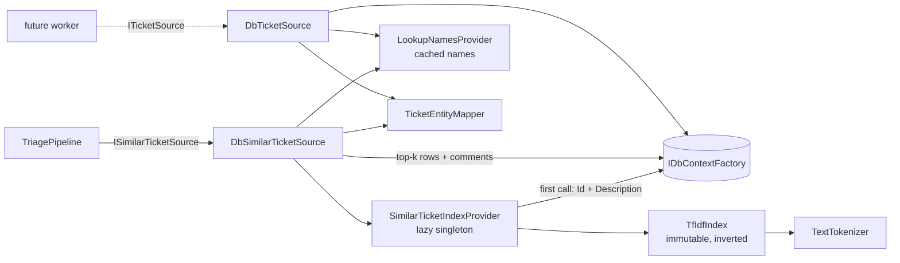

# Similar-ticket retrieval

**Date**: 2026-09-25 · **Projects**: Infrastructure (docs and tests only elsewhere)

## Summary

Replaces `StubSimilarTicketSource` (always an empty list) with `DbSimilarTicketSource`: TF-IDF + cosine kNN in memory over the `Description` of the imported historical tickets. It also adds `DbTicketSource`, an `ITicketSource` that streams `New` tickets from SQLite (registered, no caller), and fixes the importer, which threw on a non-existent status. No LLM call, no schema change, no new package. `TriagePipeline`, Agents, Web, Batch and Core ports are unchanged.

## How it works



`FindSimilarAsync(ticket, top, ct)`:

1. Blank description or `top <= 0` returns `[]` without touching the index.
2. `SimilarTicketIndexProvider.GetAsync` returns the index; the first call loads `(Id, Description)` of all rows with a non-blank description (ordered by Id) and builds the index.
3. `TfIdfIndex.Search(description, top, ticket.Id)` returns `(Id, Score)` hits.
4. One query loads the hit rows with comments; names come from `LookupNamesProvider`; `TicketEntityMapper` maps them in hit order. A row deleted since the build is skipped.

### Engine

| Aspect | Behaviour |
|---|---|
| Tokenizer | Input cut at `MaxTextLength` = 20 000 chars, `Normalize(FormC)`, `ToLowerInvariant`, split on non letter/digit (`char.IsLetterOrDigit`), tokens < 2 chars dropped. No stemming, no stop words. |
| Weights | tf' = `1 + ln(tf)`, idf = `ln((1+N)/(1+df)) + 1`, L2-normalised per document. N counts documents with at least one token. |
| Index | Inverted: `Posting[][]` by term id (`Doc`, normalised weight), `int[]` doc index to row Id. |
| Query | Same vocabulary and idf; out-of-vocabulary terms ignored, normalised over in-vocabulary terms only. |
| Scoring | Scores accumulated into a `double[]` rented from `ArrayPool<double>` per call (no shared mutable state, safe concurrently). Only documents sharing a term are touched. |
| Ranking | Score > 0, `Id != excludeId`; sort score desc, then Id asc; take `top`; score clamped to 1.0 (float drift). |

### Mapping (`TicketEntityMapper`)

`Id` = row id, `Key` = `DB-{Id}`, `Summary`, `Description`, `Assignee`, `Resolution`, work type / service / team names from lookups, `Created` (UTC), comments ordered by `CommentId`. **`Urgency`, `Impact`, `Priority` are always null** (random in the training data, ADR-0001). Only original columns are read, never the `*Changed` columns.

### `DbTicketSource`

Streams tickets with status `New` (resolved by name) ordered by `CreatedDate`, then `Id`. Keyset paging (`CreatedDate > d OR (CreatedDate = d AND Id > id)`, batch size 100, `AsSplitQuery` for the comments), a **fresh `DbContext` per batch**, so no reader stays open across `yield` while the pipeline writes `Retries`. Cancellation is checked before each batch and each `yield`.

### Importer

`TrainingDataImporter` looked up status `"Finished"`, which does not exist, so `ImportAsync` threw and a real DB never held training rows. It now sets `HumanApproved` for tickets with a `Resolution`; others stay `New`. Nothing else changed.

## Design decisions

| Decision | Reason |
|---|---|
| Description only as query and corpus text | The summary is deliberately misleading in the challenge data (FR1). |
| Own TF-IDF instead of embeddings / FTS5 | No schema change, no package, no LLM call, deterministic and unit-testable. The port allows swapping in embeddings later. |
| Pure engine (`TextTokenizer`, `TfIdfIndex`) separate from DB code | Testable without EF/DI; immutable after build, so concurrent searches need no locks. |
| Provider = `SemaphoreSlim` + `volatile` index, not `Lazy<Task>` | A cached task would keep the first caller's cancellation or failure forever. Failed or cancelled builds publish nothing; the next call retries. Concurrent first callers build once. |
| Build runs in `Task.Run` (deviation from plan) | CPU-bound tokenising/weighting would otherwise run on the caller's thread and block it. |
| Score buffer pooled with `ArrayPool` (deviation) | Avoids a `double[N]` allocation (~160 KB for 20k docs) per query. |
| `MaxTextLength` cap of 20 000 (deviation) | A huge description cannot blow up build or query time. |
| `LookupNamesProvider` singleton (deviation) | Lookup tables are seeded and static; loading them once removes three queries per call. Same gate/retry pattern as the index provider. |
| Sources are singletons, `TriagePipeline` stays scoped | Stateless, depend only on singletons; no captive-dependency problem for a future `BackgroundService`. |
| `TryAdd*` registration | Same pattern as `EfTriageFailureStore`; Agents registers with `Add` after Infrastructure and would override. |
| Similar-ticket urgency/impact/priority null | ADR-0001. |
| Logging | Information once: document/term counts and build time. Debug: hit counts and timings. Never text, tokens or comments. |

## Configuration

None. No new option, Aspire parameter or environment variable. Batch size (100) and `MaxTextLength` (20 000) are constants; the number of results is `Triage:SimilarTicketCount` (existing, see the triage-pipeline README).

DI (in `AddTriageInfrastructure`):

```csharp
services.TryAddSingleton<LookupNamesProvider>();
services.TryAddSingleton<SimilarTicketIndexProvider>();
services.TryAddSingleton<ISimilarTicketSource, DbSimilarTicketSource>();
services.TryAddSingleton<ITicketSource, DbTicketSource>();
```

All new types are `internal sealed`.

## Running it

```bash
aspire run        # Development imports training.json on startup (idempotent)
dotnet test --project tests/TicketTriage.Infrastructure.Tests
```

- No migration and no schema change. A local DB left empty by the old failing importer is imported on the next Development start.
- The index is built on the first `FindSimilarAsync` call, not at startup. In the Aspire structured logs look for `Built similar-ticket index: {DocumentCount} documents, {TermCount} terms in {ElapsedMs} ms` (source `SimilarTicketIndexProvider`).
- Currently reachable only through `TriagePipeline`; Batch and Web do not call the pipeline yet, so nothing triggers the build in a normal run.

## Tests

`tests/TicketTriage.Infrastructure.Tests` (xUnit v3, SQLite in-memory via `SqliteTestDatabase`).

| Area | Covered |
|---|---|
| `TextTokenizerTests` | Punctuation, casing, short tokens, Unicode letters, NFD = NFC, null/blank. |
| `TfIdfIndexTests` | Distinctive term ranks first, top/descending/(0,1], ties by Id, self-exclusion, identical text = 1.0, blank query, empty corpus, out-of-vocabulary, IDF and sublinear TF effects, `top <= 0`, token-less documents ignored. |
| `SimilarTicketIndexProviderTests` | Concurrent first calls load once and share the instance; cancelled build retried; loader exception not cached; second caller cancelled while waiting for the gate. |
| `LookupNamesProviderTests` | Loads once and caches; factory failure not cached. |
| `DbSimilarTicketSourceTests` | AC1-AC5: ranking, mapping (`DB-{Id}`, names, comments, null severity), self-exclusion, no dedup without Id, blank description, `top = 0`, empty DB, blank-description rows never candidates; pipeline end-to-end with `DB-` keys. |
| `DbTicketSourceTests` | Only `New`, `CreatedDate, Id` order, mapping, batch boundaries with ties, cancellation mid-stream, empty. |
| `TrainingDataImporterTests` | Seeded lookups do not throw; resolved tickets get `HumanApproved`. |
| `RegistrationTests` | DI resolves `DbSimilarTicketSource` and `DbTicketSource`; provider is a singleton across scopes. |

Not covered: retrieval quality on the real 20k tickets (no precision measurement), build time and memory on real data, a real `data/triage.db`, any Web/Batch caller.

## Known limitations

| Limitation | Note |
|---|---|
| Index built once per process, never refreshed | Tickets imported or added after the first call are not found until restart. Fine while training data is static. |
| First call builds inside the per-ticket timeout | `Triage:TicketTimeoutSeconds` (60) applies. Expected ~1-2 s for 20k rows, **unmeasured on real data**. A timed-out build is retried by the pipeline. No startup warm-up. |
| Unresolved imported tickets have status `New` | `DbTicketSource` would stream them once a worker is wired. **Needs a guard (e.g. a source/status filter) before wiring**, otherwise history is re-triaged (also noted in [architecture §5.1](../../architecture.md) and CLAUDE.md). |
| Stale comment in `TicketEntity.cs` | The comment on `StatusId` still says `0 = New, 1 = Finished`; the seed is `New, Reviewing, Reviewed, HumanRejected, HumanApproved`. Not fixed (code out of scope of the docs alignment). |
| `SimilarTicketKeys` are `DB-{Id}`, not Jira keys | No key column in the schema (triage-pipeline open point 3). |
| Description-only TF-IDF | No stemming, no stop words, no synonyms; weak across languages (DE/FR/EN tokens are compared as-is). No hybrid dense + BM25 (see `docs/ticket_triage_architektur.md`). |
| Similar-ticket content is untrusted personal data | Description, comments and assignee flow into downstream prompts. Prompt builders must keep it in user content (never instructions) and truncate it. Not enforced here. |

Unaddressed review NITs: `TicketEntityMapper.KeyFor` could be private; tests use magic status ids; token length counts UTF-16 chars, so a supplementary-plane character counts as 2; the in-memory blank-description filter in the corpus load is redundant for most rows (kept for whitespace-only values, since SQLite `trim()` only strips spaces); `DbTicketSourceTests.GetTickets_Smoke_...` duplicates other coverage.

## AI assistance

Parts of this feature were developed with Claude Code (Anthropic). All code was reviewed and understood by the team.
