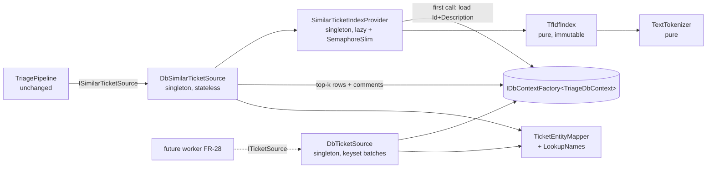

# Plan: similar-ticket-retrieval

**Date**: 2026-09-25 · **Source of truth**: [requirements.md](requirements.md) (APPROVED) · **Projects touched**: TicketTriage.Infrastructure, TicketTriage.Infrastructure.Tests, docs

No schema change, no new package, no LLM call. `TriagePipeline`, Agents, Web, Batch and Core ports are untouched. No commits in this workflow.

---

## 1. Architecture overview

Retrieval is split into a **pure TF-IDF engine** (`TextTokenizer`, `TfIdfIndex` — immutable after build, no EF/DI, fully unit-testable), a **lazy thread-safe singleton provider** (`SimilarTicketIndexProvider`) that loads `(Id, Description)` rows once via `IDbContextFactory<TriageDbContext>` and builds the engine on first call, and the **port implementation** (`DbSimilarTicketSource`) that asks the index for top-k `(Id, Score)` hits, loads those rows + comments in one query and maps them with a shared `TicketEntityMapper`. `DbTicketSource` reuses the same mapper to stream `New` tickets.



Namespaces/folders: `TicketTriage.Infrastructure.Retrieval` (`Retrieval/`: tokenizer, index, provider, similar source) and `TicketTriage.Infrastructure.Sources` (`Sources/`: mapper, `DbTicketSource`). All new types `internal sealed` (InternalsVisibleTo for the test project already exists).

### Settled design points

| Point | Decision |
|---|---|
| **Sparse representation** | **Inverted index**: `Posting[][] _postings` indexed by term id, `readonly record struct Posting(int Doc, double Weight)` with weights already L2-normalised per document. Query → small `(termId, weight)` list; scores accumulated into a per-call `double[docCount]` — only documents sharing a term are touched, score-0 docs drop out naturally. Parallel arrays `int[] _ids` (doc index → row Id). |
| **Weighting** | tf' = `1 + ln(tf)`; idf = `ln((1 + N) / (1 + df)) + 1` (smoothed, always ≥ 1 so a term in every doc still contributes > 0); L2-normalise. Query uses the same vocabulary/IDF; out-of-vocabulary query terms are ignored and the query is normalised over in-vocabulary terms only. N = documents with ≥ 1 token (docs with zero tokens are skipped — they can never score > 0). |
| **Tokenizer** | `text.Normalize(NormalizationForm.FormC).ToLowerInvariant()`, then scan with `char.IsLetterOrDigit`; every other char is a separator; drop tokens with length < 2. No stemming, no stop words. NFC first so decomposed "é" (e + U+0301) doesn't split a word. |
| **Ranking** | Candidates: score > 0, `Id != excludeId`. Sort score desc, then Id asc; take `top`. Clamp `Math.Min(score, 1.0)` (float drift can give 1.0000000002 for identical texts). `top <= 0` → empty. Corpus is loaded ordered by Id so ties are deterministic. |
| **Index lifetime** | `SimilarTicketIndexProvider` = singleton owning `volatile TfIdfIndex? _index` + `SemaphoreSlim _gate = new(1, 1)`. `DbSimilarTicketSource` and `DbTicketSource` are also singletons (stateless; depend only on singletons: factory, provider, logger) — avoids captive-dependency problems for the future `BackgroundService` worker. `TriagePipeline` stays scoped (scoped → singleton is fine). |
| **First build + cancellation** | Fast path `if (_index is { } i) return i;` → `await _gate.WaitAsync(ct)` → double-check → `await _load(ct)` → `TfIdfIndex.Build(docs)` → publish to `_index` → release in `finally`. If the load is cancelled/throws, nothing is published, so the next caller retries the build. Concurrent first callers wait on the gate and then see the published index → built once (AC6). **Not** `Lazy<Task>` / a cached `Task` created with the first caller's token (would cache a cancelled/faulted task forever). |
| **Testability of the provider** | Two constructors: **public** `(IDbContextFactory<TriageDbContext>, ILogger<SimilarTicketIndexProvider>)` — the only one DI sees (MS.DI uses public ctors only) — and **internal** `(Func<CancellationToken, Task<IReadOnlyList<CorpusDocument>>> load, ILogger<...>)` so tests can count loads and gate them with a `TaskCompletionSource`. Implements `IDisposable` to dispose the semaphore (CA1001/CA2213). |
| **Corpus load query** | `db.Tickets.AsNoTracking().Where(t => t.Description != null && t.Description != "").OrderBy(t => t.Id).Select(t => new CorpusDocument(t.Id, t.Description!))`, then `string.IsNullOrWhiteSpace` filtering in memory (SQLite `trim()` only strips spaces). |
| **Entity → Ticket mapping** | `TicketEntityMapper.ToTicket(TicketEntity, LookupNames)` — pure static. `LookupNames` = record of three `IReadOnlyDictionary<int,string>` (WorkTypes, AffectedBusinessOrITServices, ServiceTeams), loaded **once per call/stream** via `LookupNames.LoadAsync(TriageDbContext, ct)` (three tiny `AsNoTracking().ToDictionaryAsync(e => e.Id, e => e.Name)`; never per ticket → no N+1). |
| **Mapped fields (FR3)** | `Id = e.Id`; `Key = $"DB-{e.Id}"` (via `string.Create(CultureInfo.InvariantCulture, …)`); `Summary`, `Description`, `Assignee`, `Resolution`; `WorkType` = lookup name; `AffectedServices` / `ServiceTeams` = `[name]` or `[]`; `Created = new DateTimeOffset(DateTime.SpecifyKind(e.CreatedDate, DateTimeKind.Utc))`; `Comments` ordered by `CommentId`; **`Urgency`, `Impact`, `Priority` = null** (why-comment citing ADR-0001). Only **original** columns are used, never `*Changed` (pending AI output). |
| **Top-k fetch** | `db.Tickets.AsNoTracking().Include(t => t.Comments.OrderBy(c => c.CommentId)).Where(t => ids.Contains(t.Id))` — one round trip + lookups; re-ordered by hit order; an Id that vanished since the build is skipped. |
| **DbTicketSource streaming** | Keyset paging in batches (default 100): `Where(StatusId == newId && (CreatedDate > lastDate \|\| (CreatedDate == lastDate && Id > lastId))).OrderBy(CreatedDate).ThenBy(Id).Take(batch)` with comments included; **fresh DbContext per batch** (no open reader while the pipeline writes `Retries`). `New` status id resolved **by name**. `[EnumeratorCancellation]`, `ct` passed to every query and checked before each `yield`. |
| **Registration** | Replace `TryAddScoped<ISimilarTicketSource, StubSimilarTicketSource>()` with `TryAddSingleton<SimilarTicketIndexProvider>()`, `TryAddSingleton<ISimilarTicketSource, DbSimilarTicketSource>()`, and (slice 3) `TryAddSingleton<ITicketSource, DbTicketSource>()`. Keep **TryAdd** (same pattern as `EfTriageFailureStore`). Agents registers after Infrastructure with plain `Add`, so a future Agents-side `ISimilarTicketSource` would override — nothing there registers one today. Narrow the `// TODO: implement - replace the stubs…` comment to the remaining stubs. |
| **Logging** | Provider, once, Information: `"Built similar-ticket index: {DocumentCount} documents, {TermCount} terms in {ElapsedMs} ms"`. Source, Debug: `"Similar-ticket search for {TicketKey}: {HitCount} hits in {ElapsedMs} ms"`. `DbTicketSource`, Debug: batch counts. Never a description, token, comment or query text. Exceptions propagate unlogged (pipeline records `Similar:Exception` / `Similar:Timeout`). |

---

## 2. Slices

| # | Name | Goal | Size | Depends on |
|---|---|---|---|---|
| 1 | TF-IDF engine (pure) | Tokenizer + immutable inverted TF-IDF index with cosine top-k search, self-exclusion, ties, clamping | M | – |
| 2 | DB-backed similar source, end-to-end | Lazy singleton provider + `DbSimilarTicketSource` + shared mapper, DI swap, stub removed, importer status fix → pipeline gets real similar tickets | M | 1 |
| 3 | `DbTicketSource` | Stream `New` tickets from SQLite in `CreatedDate, Id` order; registered in DI only | S | 2 (mapper) |
| 4 | Docs | Architecture reorder, stub table, pipeline README, CLAUDE.md/skill notes | S | 2, 3 |

Slices 1+2 are the thinnest end-to-end path; slice 1 is split off because it is pure and keeps slice 2 at 3 new production files. Slice 2 must include the importer fix: today `ImportAsync` throws on `SingleAsync(... "Finished")`, so a real DB never holds training rows and retrieval would always be empty.

---

## 3. Slices in detail

### Slice 1 — TF-IDF engine (pure)

**Goal**: deterministic, allocation-light TF-IDF + cosine kNN over `(Id, Text)` documents, no DB/DI dependency.

**Files**

| Path | Project | New/changed |
|---|---|---|
| `src/TicketTriage.Infrastructure/Retrieval/TextTokenizer.cs` | Infrastructure | new — `internal static class TextTokenizer { public static IReadOnlyList<string> Tokenize(string? text); }` |
| `src/TicketTriage.Infrastructure/Retrieval/TfIdfIndex.cs` | Infrastructure | new — `internal sealed record CorpusDocument(int Id, string Text)`, `internal readonly record struct SimilarityHit(int Id, double Score)`, private `Posting`, `internal sealed class TfIdfIndex` with `static TfIdfIndex Build(IReadOnlyList<CorpusDocument>)`, `IReadOnlyList<SimilarityHit> Search(string? text, int top, int? excludeId)`, `int DocumentCount`, `int TermCount` |
| `tests/TicketTriage.Infrastructure.Tests/TextTokenizerTests.cs` | Infrastructure.Tests | new |
| `tests/TicketTriage.Infrastructure.Tests/TfIdfIndexTests.cs` | Infrastructure.Tests | new |

**Tests**
- `TextTokenizerTests`
  - `Tokenize_MixedPunctuation_LowercasesSplitsAndDropsShortTokens` — `"Outlook-Fehler: E-Mail 0x80 à Zürich!"` → `["outlook","fehler","mail","0x80","zürich"]`.
  - `Tokenize_UnicodeLetters_AreKeptWhole_IncludingDecomposedAccents` — ß/é/ä kept; NFD input equals NFC output.
  - `Tokenize_PunctuationOrSingleLetters_ReturnsEmpty`.
  - `Tokenize_NullOrWhitespace_ReturnsEmpty`.
- `TfIdfIndexTests`
  - `Search_DistinctiveSharedTerm_RanksThatDocumentFirst_PerAC1`
  - `Search_ReturnsAtMostTop_StrictlyDescending_ScoresInUnitInterval_PerAC2`
  - `Search_EqualScores_OrderedByIdAscending`
  - `Search_ExcludeId_NeverReturnsThatDocument_EvenIfIdentical_PerAC3`
  - `Search_IdenticalText_ScoreIsExactlyOne` (clamp)
  - `Search_BlankQuery_ReturnsEmpty_PerAC4`
  - `Search_EmptyCorpus_ReturnsEmpty_PerAC4`
  - `Search_OnlyOutOfVocabularyTerms_ReturnsEmpty`
  - `Search_NoSharedTerm_DocumentIsDropped`
  - `Search_RareTermOutweighsCommonTerm` (IDF effect)
  - `Search_RepeatedTerm_UsesSublinearTf`
  - `Search_TopZeroOrNegative_ReturnsEmpty`
  - `Build_DocumentWithoutTokens_IsIgnored`

**ACs**: AC1, AC2, AC3, AC4 (engine level); FR2, FR1 ranking rules.

**Notes**: accumulate in `double`, clamp only the result. `Search` must be safe concurrently (no shared mutable state, per-call score buffer). Two-pass `Build` (counts/vocabulary/df, then weights/norms/postings); discard per-doc dictionaries afterwards. Watch CA1822/CA1859.

### Slice 2 — DB-backed similar source, end-to-end

**Goal**: `ISimilarTicketSource` resolves to `DbSimilarTicketSource`; first call builds the index once from SQLite; the pipeline receives mapped historical tickets with `DB-{Id}` keys; stub deleted; importer works against the seeded statuses.

**Files**

| Path | Project | New/changed |
|---|---|---|
| `src/TicketTriage.Infrastructure/Retrieval/SimilarTicketIndexProvider.cs` | Infrastructure | new — lazy singleton, `ValueTask<TfIdfIndex> GetAsync(CancellationToken)`, `IDisposable` |
| `src/TicketTriage.Infrastructure/Retrieval/DbSimilarTicketSource.cs` | Infrastructure | new — blank description or `top <= 0` → `[]` **before** touching the index; then provider → `Search(description, top, ticket.Id)` → one fetch query → `LookupNames.LoadAsync` → map in hit order → `SimilarTicket(ticket, score)` |
| `src/TicketTriage.Infrastructure/Sources/TicketEntityMapper.cs` | Infrastructure | new — `internal sealed record LookupNames(...)` with `LoadAsync`, `internal static class TicketEntityMapper { ToTicket(...); KeyFor(int id); }` |
| `src/TicketTriage.Infrastructure/InfrastructureServiceCollectionExtensions.cs` | Infrastructure | changed — swap stub line for provider + source `TryAddSingleton`s, narrow TODO comment |
| `src/TicketTriage.Infrastructure/Stubs/StubSimilarTicketSource.cs` | Infrastructure | **deleted** |
| `src/TicketTriage.Infrastructure/Import/TrainingDataImporter.cs` | Infrastructure | changed — `finishedStatusId` → `approvedStatusId` with `s.Name == "HumanApproved"`; nothing else |
| `tests/TicketTriage.Infrastructure.Tests/SqliteTestDatabase.cs` | Infrastructure.Tests | new helper (in-memory `SqliteConnection`, `AddDbContextFactory`, `EnsureCreatedAsync`, `AddTicketAsync(...)`, `IAsyncDisposable`) — same pattern as `EfTriageFailureStoreTests` |
| `tests/TicketTriage.Infrastructure.Tests/SimilarTicketIndexProviderTests.cs` | Infrastructure.Tests | new |
| `tests/TicketTriage.Infrastructure.Tests/DbSimilarTicketSourceTests.cs` | Infrastructure.Tests | new |
| `tests/TicketTriage.Infrastructure.Tests/TrainingDataImporterTests.cs` | Infrastructure.Tests | new |
| `tests/TicketTriage.Infrastructure.Tests/RegistrationTests.cs` | Infrastructure.Tests | changed |

**Tests**
- `SimilarTicketIndexProviderTests` (internal ctor, counting + gated loader)
  - `GetAsync_ConcurrentFirstCalls_LoadOnce_AndShareInstance_PerAC6`
  - `GetAsync_CancelledDuringFirstBuild_Throws_AndNextCallRetries`
  - `GetAsync_LoaderThrows_IsNotCached_NextCallRetries`
- `DbSimilarTicketSourceTests` (`SqliteTestDatabase`, seeded lookups)
  - `FindSimilar_DistinctiveTerm_ReturnsThatRowFirst_PerAC1`
  - `FindSimilar_MapsKeyNamesCommentsAndNullsSeverity_PerAC5`
  - `FindSimilar_AtMostTop_DescendingScores_PerAC2`
  - `FindSimilar_QueryWithSameId_NeverReturnsOwnRow_PerAC3`
  - `FindSimilar_QueryWithoutId_IsNotDeduplicated`
  - `FindSimilar_BlankDescription_ReturnsEmpty_PerAC4`
  - `FindSimilar_EmptyDatabase_ReturnsEmpty_PerAC4`
  - `FindSimilar_RowsWithBlankDescription_AreNeverCandidates`
  - `Pipeline_WithDbSimilarSource_SuggestionCarriesDbKeys` (thin e2e with fakes from `TestSupport`)
- `TrainingDataImporterTests`
  - `Import_SeededLookups_DoesNotThrow_AndSetsHumanApprovedForResolved_PerAC9` (temp JSON file, deleted in `finally`)
- `RegistrationTests`
  - rename to `Pipeline_ResolvesAsTriagePipeline_WithDbSimilarSource_PerAC8` → `BeOfType<DbSimilarTicketSource>()`
  - add `SimilarTicketIndexProvider_IsSingletonAcrossScopes`
  - remove `using TicketTriage.Infrastructure.Stubs;`

**ACs**: AC1–AC6, AC8 (similar part), AC9, AC10; FR1, FR3, FR5.

**Notes**: `TicketNormalizer` keeps `Id` and `Description`, so self-exclusion works through the pipeline. The first build shares the per-ticket timeout; a timed-out build is retried by the pipeline. Context per operation. The stale comment `// FK to Status (0 = New, 1 = Finished).` in `TicketEntity.cs` is outside the allowed change list — leave it.

### Slice 3 — `DbTicketSource` (`ITicketSource`)

**Goal**: DI-registered `ITicketSource` streaming all `New` tickets in `CreatedDate, Id` order, mapped like FR3 with `Id` and `Key` set. No caller.

**Files**

| Path | Project | New/changed |
|---|---|---|
| `src/TicketTriage.Infrastructure/Sources/DbTicketSource.cs` | Infrastructure | new — public ctor `(IDbContextFactory<TriageDbContext>, ILogger<DbTicketSource>)` → internal ctor `(…, int batchSize)` (default 100); keyset batches, one context per batch, lookups + status id loaded once |
| `src/TicketTriage.Infrastructure/InfrastructureServiceCollectionExtensions.cs` | Infrastructure | changed — `TryAddSingleton<ITicketSource, DbTicketSource>()` |
| `tests/TicketTriage.Infrastructure.Tests/DbTicketSourceTests.cs` | Infrastructure.Tests | new |
| `tests/TicketTriage.Infrastructure.Tests/RegistrationTests.cs` | Infrastructure.Tests | changed |

**Tests**
- `GetTickets_YieldsOnlyNewTickets_InCreatedDateThenIdOrder_PerAC7`
- `GetTickets_SetsIdAndDbKey_AndMapsLikeSimilarSource_PerAC7`
- `GetTickets_AcrossBatchBoundaries_NoDuplicatesOrGaps` (batchSize 2, 5 rows, tie at the boundary)
- `GetTickets_CancelledMidStream_ThrowsOperationCanceled_PerAC7`
- `GetTickets_EmptyOrNoNewTickets_YieldsNothing`
- `RegistrationTests.TicketSource_ResolvesAsDbTicketSource_PerAC8`

**ACs**: AC7, AC8 (ticket-source part), AC10; FR4.

**Notes**: `CreatedDate` is `DateTime` (ISO TEXT in SQLite, sortable) — the `DateTimeOffset` limitation does not apply. Keyset predicate `(CreatedDate > d) || (CreatedDate == d && Id > id)`, never `Skip`. No context/reader held open across `yield`.

### Slice 4 — Docs (Phase 6)

**Goal**: docs match the code (FR6).

- `docs/ticket_triage_architektur.md` §2: reorder to `P --> RS --> WT --> SV`; `retrieve_similar_tickets` text → TF-IDF + Cosine-kNN (in-memory) über Description, Selbst-Ausschluss per Id; note that hybrid dense+BM25 is deferred.
- `docs/architecture.md`: stub table (~l.118, ~l.124) for `DbSimilarTicketSource` / `DbTicketSource`.
- `docs/features/triage-pipeline/README.md`: ports table rows, open point 3 (importer now `HumanApproved`, keys are `DB-{Id}`), "Other".
- `CLAUDE.md`: `ITicketSource` → `DbTicketSource`; drop `ISimilarTicketSource` from the stub list.
- `.claude/skills/sqlite-efcore/SKILL.md` §Similar-ticket retrieval: describe the implemented TF-IDF approach; embeddings/FTS5 → future options.
- New `docs/features/similar-ticket-retrieval/README.md`.

---

## 4. Migrations

**None.** Only existing tables are read (`Ticket`, `Comments`, lookups) and one value the importer writes changes; `HumanApproved` (id 4) is already seeded via `HasData`. The index lives in process memory and is rebuilt per process start. Model unchanged → no need to delete `data/triage.db*`. Caveat: an existing local DB that is empty (because the old importer threw) gets imported on the next Development start.

## 5. Build / test commands

```bash
dotnet build TicketTriage.slnx
dotnet test --project tests/TicketTriage.Infrastructure.Tests
dotnet test --solution TicketTriage.slnx --filter "Category!=Integration"
dotnet format TicketTriage.slnx --verify-no-changes
```

## 6. Risks

| # | Risk | Mitigation |
|---|---|---|
| R1 | First-call build counts against `TicketTimeoutSeconds` (60 s) | Expected ~1–2 s for 20k rows; logged at Information. A startup warm-up would touch host wiring (out of scope) — follow-up if slow. |
| R2 | SQLite locking from a streaming reader held across `yield` | Keyset batches, fresh context per batch, materialised before yielding. |
| R3 | Stale index (tickets added after build) | Accepted: training data static during a run; documented. |
| R4 | Description-only TF-IDF, no stemming, cross-language | Accepted; port allows swapping in embeddings later. |
| R5 | Memory (~25 MB postings) | Accepted. |
| R6 | DI override order (Agents `Add` wins over Infrastructure `TryAdd`) | Intended; `RegistrationTests` pins Infrastructure-only resolution. |
| R7 | Analyzer breaks (CA1001, CA1305, CA1822, CA1859) | `IDisposable` provider, invariant culture key, concrete private types, build after each slice. |
| R8 | Ticket text in logs/exceptions | Counts/timings only. |
| R9 | `SimilarTicketKeys` are `DB-{Id}`, not Jira keys | Known open point #3; restated in docs. |
| R10 | Imported unresolved tickets stay `New` → streamed once a worker exists | Decided; no caller today. |
