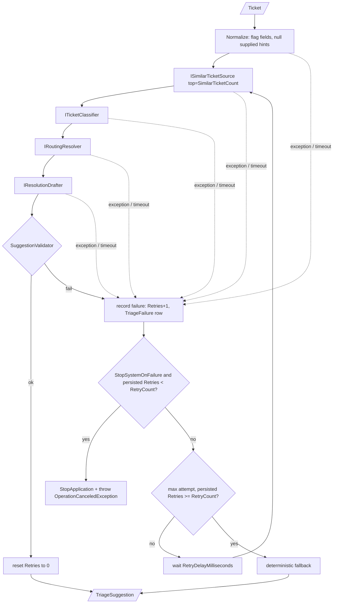

# Triage pipeline

**Date**: 2026-09-25 · **Projects**: Core / Infrastructure

## Summary

Replaces `StubTriagePipeline` with a real, stream-based `ITriagePipeline` in `TicketTriage.Infrastructure/Pipeline`. It chains the Core ports per ticket, validates the result, retries failed attempts, logs failures to a table and falls back to a deterministic suggestion when retries are exhausted. Agents, Razor UI and the importer are unchanged. The pipeline itself makes no LLM call; it only calls the ports.

## How it works

### Ports (Core, `Abstractions/TriageAbstractions.cs`)

| Port | Role |
|---|---|
| `ITicketSource` | `GetTicketsAsync(ct)` yields `IAsyncEnumerable<Ticket>`. Implemented by `DbTicketSource` (streams `New` tickets, [details](../similar-ticket-retrieval/README.md)); no caller yet. |
| `ISimilarTicketSource` | `FindSimilarAsync(ticket, top, ct)`; excludes the ticket itself. Replaces `ISimilarTicketRetriever`. Implemented by `DbSimilarTicketSource` (TF-IDF over `Description`, [details](../similar-ticket-retrieval/README.md)); the former stub is deleted. |
| `ITicketClassifier`, `IRoutingResolver`, `IResolutionDrafter` | unchanged ports. Classifier and drafter are now LLM-backed in Agents ([triage-agent](../triage-agent/README.md)); `IRoutingResolver` is `StatisticsRoutingResolver` (majority vote from in-memory routing statistics, `Infrastructure/Routing`) |
| `ITriageFailureStore` | `RecordFailureAsync(TriageFailure, ct)` returns persisted `Retries` or null; `ResetRetriesAsync(ticketId, ct)`. Implemented by `EfTriageFailureStore`. |
| `ITriagePipeline` | `TriageAsync(Ticket, ct)` (single) and `TriageAsync(IAsyncEnumerable<Ticket>, ct)` (stream). |

`Ticket` has `[JsonIgnore] int? Id` (DB id, not in the JSON files). It maps a stream ticket to its row.

### Stream

Tickets are processed **sequentially in input order**, one suggestion per input ticket. One failing ticket never ends the stream. Empty input gives empty output. `BatchRunner` calls the stream overload ([batch-runner](../batch-runner/README.md)); `DbTicketSource` has no caller yet.

### Per ticket



- **Normalize** (`TicketNormalizer`): flags `EmptySummary`, `EmptyDescription`, `NoServices`, `UnknownWorkType/Urgency/Impact`. Supplied work type, urgency, impact and priority are always set to null before the ports see the ticket (the model must classify from the text). Flags are logged at Information without ticket text. Text is forwarded unchanged.
- **Priority** is computed by `TriageSuggestion` from `PriorityMatrix.Resolve(urgency, impact)`; the pipeline never sets it.
- **Team / assignee** come from `IRoutingResolver`, `DraftComment` and `ResolutionStatus` from `IResolutionDrafter` (`ResolutionDraft(Status, Comment)`; the drafter also receives the routing decision). The fallback status is the majority of the similar tickets' `Resolution` values (ties: summed score, then enum order), else `Done`; the validator rejects a null or undefined status (`InvalidResolutionStatus`).
- **Retries reuse work**: similar tickets are fetched once per ticket and reused on later attempts.

### Retry, timeout, backoff, fallback

| Rule | Behaviour |
|---|---|
| Timeout | Each attempt runs under a linked `CancellationTokenSource` with `TicketTimeoutSeconds`. Timeout = failed attempt (`<Step>:Timeout`). |
| Failed attempt | Any exception, timeout or validation failure: `Retries` +1 in DB and one `TriageFailure` row. |
| Validation (`SuggestionValidator.Validate(suggestion, RoutingStatistics)`) | All 7 output fields. Codes: `InvalidWorkType`, `InvalidUrgency`, `InvalidImpact`, `NoAffectedServices`, `UnknownService` (not the canonical `ServiceCatalog` name), `MissingTeam` / `InconsistentTeam` and `MissingAssignee` / `InconsistentAssignee` (first service known to the statistics: teams must be exactly `[statistics team]`, assignee the statistics assignee; unknown service: no team, no assignee), `PriorityMismatch` (defensive, priority is computed), `InvalidResolutionStatus`, `EmptyComment`. The pipeline awaits the `IRoutingStatisticsSource` snapshot in the Validate step. The fallback is not validated: it derives its routing from the same statistics (no resolver call; if the statistics cannot be loaded it carries no routing) and has a blank comment by design. |
| Exhausted | `max(attempts in this run, persisted Retries) >= RetryCount`. So a ticket with persisted `Retries` already at the limit falls back after its first new failure. |
| Backoff | Fixed `RetryDelayMilliseconds` between attempts (not exponential); honours cancellation. |
| Fallback | Work type and service from the similar tickets: most frequent, ties by summed score, then enum order / ordinal name. Only services found in `ServiceCatalog`. Defaults: `Incident` (no usable work type), no services, Urgency Medium, Impact Moderate. Routing via `IRoutingResolver` (empty on error), no comment. |
| Whole-stream cancellation | `OperationCanceledException` from the caller's token is rethrown: no failure row, no fallback. |
| Success | `Retries` reset to 0 (only if the ticket has an `Id`; a failed reset is logged and ignored). Fallback does **not** reset. |
| Poison-pill rule | With `StopSystemOnFailure`, the stop is skipped when persisted `Retries` is already `>= RetryCount`. Otherwise one bad ticket would stop the app again after every restart; it gets the fallback instead. |

### StopSystemOnFailure

For development and Batch only. On the **first** failure of a ticket (after the failure is logged, before any retry) the pipeline calls `IHostApplicationLifetime.StopApplication()` and throws `OperationCanceledException`. This applies to the stream and to the single-ticket overload. `IHostApplicationLifetime` is optional: without it the exception is still thrown. Do not enable it in a production Web host: one bad ticket would take the app down.

### Failure log and `Retries`

| Item | Detail |
|---|---|
| `Ticket.Retries` (`TicketEntity`) | int, default 0. Incremented by `ExecuteUpdate` in the same short transaction as the log insert. Reset to 0 on success. |
| Table `TriageFailure` (`TriageFailureEntity`) | `Id`, `TicketId` (nullable, **no FK**, so file tickets and removed tickets still log), `TicketKey`, `Attempt`, `Reason`, `ExceptionType`, `StackTrace`, `OccurredAtUtc`. |
| `Reason` | `<Step>:<Code>`, e.g. `Classify:Exception`, `Route:Timeout`, `Validate:EmptyComment`. Never contains `ex.Message` or ticket text. |
| `StackTrace` | Frames only (outer and inner exceptions, no messages), truncated to 4000 characters. |
| Ticket without `Id` | Failure row is written with `TicketId = null`; the in-memory attempt counter bounds the retries. |
| Store failure | Logged (exception type only), attempt still counts in memory, original error is not masked. |

## Design decisions

| Decision | Reason |
|---|---|
| Pipeline in Infrastructure, no EF reference | Core ports only; persistence behind `ITriageFailureStore`. A test checks the pipeline types do not depend on EF Core. |
| Sequential processing | Deterministic order, single SQLite writer, predictable token spend. |
| Reason codes instead of exception messages | Messages can echo ticket text (personal data). Frames are stored, messages are not. |
| No FK on `TriageFailure.TicketId` | Failures must be logged for tickets that are not in the DB. |
| Stream throws `OperationCanceledException` on stop | Distinguishes "stopped" from "exhausted"; the plan (D2) had assumed a quiet end, the code throws. |
| Fallback services: single most frequent | Simple and deterministic; multi-service fallback not attempted. |
| `EnsureCreated`, no migrations | Decision of this feature; see below. |

Trade-off: every attempt repeats classify, route and draft (up to `RetryCount` x 3 LLM calls per ticket). Similar tickets are cached per ticket only.

## Configuration

Section `Triage` in `src/TicketTriage.Web/appsettings.json` and `src/TicketTriage.Batch/appsettings.json` (identical values). Bound to `TriageOptions`, validated on start (out-of-range values stop the host).

| Key | Default | Range | Description |
|---|---|---|---|
| `Triage:RetryCount` | 3 | 1-10 | Failed attempts per ticket before the fallback. |
| `Triage:StopSystemOnFailure` | false | | Stop the host on the first failure (dev / Batch only). |
| `Triage:TicketTimeoutSeconds` | 60 | 1-300 | Timeout per attempt (also the routing call in the fallback). |
| `Triage:SimilarTicketCount` | 10 | 1-50 | `top` passed to `ISimilarTicketSource`. |
| `Triage:RetryDelayMilliseconds` | 500 | 0-10000 | Fixed pause between attempts. |

No Aspire parameter; set env vars as `Triage__RetryCount` etc. if needed.

## Running it

```bash
dotnet build TicketTriage.slnx
dotnet test --solution TicketTriage.slnx --filter "Category!=Integration"
```

Schema: `DatabaseInitializer` uses `EnsureCreatedAsync` (no migrations exist). It never alters an existing database. **After pulling this feature delete `data/triage.db*` once**, otherwise queries fail with `no such column: Retries` or `no such table: TriageFailure`. Development then recreates the schema and re-imports `training.json`.

Look at failures with any SQLite client: `SELECT * FROM TriageFailure ORDER BY Id DESC;`. In the Aspire dashboard, warnings from `TriagePipeline` ("Triage attempt N for KEY failed: Step:Code") appear in the structured logs.

## Tests

`tests/TicketTriage.Infrastructure.Tests` (xUnit v3, added to `TicketTriage.slnx`). Fake ports plus SQLite in-memory for the store.

| Area | Covered |
|---|---|
| Stream (`TriagePipelineTests`) | N in, N out in order; empty stream; `top` and ticket passed to the source; team/assignee from router, priority from matrix; step order. |
| Retry (`TriageRetryTests`) | Fail once then succeed; always fail gives fallback and stream continues; persisted `Retries` at the limit; timeout; cancellation propagates without record/fallback; validation codes; store failing; ticket without `Id`; no ticket text in reason, no message in stack trace; reset on success, not on fallback; backoff honours cancellation; fallback ranking rules; statistics failing in fallback; router disagreeing with the statistics -> retry -> fallback with consistent routing. |
| Stop (`StopSystemOnFailureTests`) | Log then stop before any retry; poison-pill rule; single-ticket overload throws; works without lifetime; off means retry + fallback. |
| Store (`EfTriageFailureStoreTests`) | Column default, increment, null/unknown id, truncation to 4000, reset, no EF dependency in pipeline types. |
| Normalizer, registration | Flags and nulled hints; DI resolves the pipeline; options bind and reject invalid values. |

Not covered: end-to-end run against a real `data/triage.db`, Web/Batch wiring (no caller uses the stream yet).

## Known limitations

### Open points (known incongruencies, not resolved here)

1. **Worker model vs retry model: resolved in the docs.** The pipeline's `Ticket.Retries` + `TriageFailure` is the only retry mechanism; the worker (planned) adds no counter and no `Failed` status ([architecture §5.2.2](../../architecture.md), [ADR-0002](../../adr/0002-background-analysis-worker.md)). A `ClaimedAt` lease column is planned, no worker exists in code.
2. **DB statuses: resolved in the docs.** The docs now use the DB statuses `New/Reviewing/Reviewed/HumanRejected/HumanApproved` ([architecture §5.1](../../architecture.md)). The pipeline does not change ticket status. The semantics of `Reviewed` are still open.
3. **Importer status and keys.** `TrainingDataImporter` now sets `HumanApproved` for tickets with a `Resolution` (it used to look up a non-existent `"Finished"` and throw); tickets without one stay `New`. The DB still has no Jira key column, so `SimilarTicketKeys` contain `DB-{Id}`, not Jira keys.
4. **`TriageResult.Resolution`: resolved** (score-completeness slice 3); the status is written in the lowercase export vocabulary.
5. **`ServiceCatalog` holds the real 20 names**, and the validator checks services against it (`UnknownService`; score-completeness slice 4).
6. **`TriageSuggestion.ResolutionStatus`: resolved** (score-completeness slice 3); `IResolutionDrafter` returns status and comment.
7. `EnsureCreated` never migrates an existing database (delete `data/triage.db*`).

### Other

- `DbTicketSource` exists but has no caller; `BatchRunner` streams the challenge file directly (transitional; target is ingest → worker → export, ADR-0002) and the analysis worker is not wired yet.
- Backoff is fixed, not exponential; no jitter.
- After exhaustion a persisted `Retries` value is not cleared until a later success; a fallback ticket stays at the limit.
- Classify and draft are LLM-backed (Agents), routing is `StatisticsRoutingResolver` (majority vote; the assignee is near-random in the data).
- Confidence and `LowConfidence` were dropped as not needed (the `Confidence` property no longer exists).
- Validation covers all 7 output fields (FR-33, score-completeness slice 4).

## AI assistance

Parts of this feature were developed with Claude Code (Anthropic). All code was reviewed and understood by the team.
