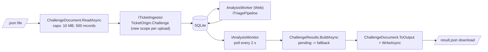

# Upload frontend (`/upload`)

**Date**: 2026-09-25 · **Projects**: Infrastructure / Web / Batch

## Summary
`/upload` in the Web app takes a challenge JSON file, ingests its tickets, waits while the Web `AnalysisWorker` analyses them and offers `result.json` for download, without the command line. The output is byte-identical to what Batch writes for the same input. The page never calls the LLM.

## How it works



1. **Parse.** `ChallengeDocument.ReadAsync(Stream)` reads at most 10 MB, accepts an envelope (`records` array) or a plain array, and gives keyless records the key `#n`. Errors are `ChallengeFormatException` with positions and type names only, never ticket values.
2. **Ingest.** `ChallengeUploadService.UploadAsync` resolves `ITicketIngestor` from a fresh DI scope (the scoped `DbContext` must not live as long as a circuit) and ingests with `TicketOrigin.Challenge`. Result: counts Created / Updated / Unchanged / Locked (Locked = already reviewed, not re-analysed).
3. **Wait.** The page polls `GetProgressAsync` (`PeriodicTimer`, `PollIntervalSeconds`). Progress = analysed n of N, pending, fallbacks. The worker analyses in cycles (`Analysis:IntervalSeconds` = 30, `BatchSize` = 5), so 20 tickets take a few minutes, depending on LLM latency.
4. **Export.** When nothing is pending, or the user clicks "Stop waiting", or the wait times out, or the worker is not running, `ExportAsync` builds `result.json` from the stored suggestions. Tickets without a stored suggestion get the deterministic fallback (`IFallbackSuggestionProvider`), shown as "not analysed".
5. **Download.** `DotNetStreamReference` + `wwwroot/js/download.js` (`downloadFileFromStream`).

The preview table shows model output as plain `@` text (no `MarkupString`). Uploaded tickets also appear under `/tickets` (consequence of ingest).

### Worker status

| Status | Condition |
|---|---|
| `Alive` | heartbeat newer than `WorkerHeartbeatMaxAgeSeconds` (`WorkerLiveness.IsAlive`) |
| `Starting` | no or stale heartbeat, less than `WorkerStartGraceSeconds` since upload |
| `NotRunning` | no or stale heartbeat after the grace period: the page stops waiting and says so |

`TimedOut` only applies while the worker is alive and `WaitTimeoutSeconds` has passed.

### Shared code (moved out of Batch)

| Type | Location | Role |
|---|---|---|
| `ChallengeDocument`, `ChallengeFormatException` | `Infrastructure/Challenge` | stream/`JsonNode` parsing, `ToOutput`, single indented `WriteAsync` |
| `ChallengeResults.BuildAsync` | `Infrastructure/Challenge` | one row per ticket, fallback cache per id, blank `DraftComment` = fallback |
| `WorkerLiveness` | `Infrastructure/Analysis` | heartbeat age check |
| `ChallengeFile` | `Batch` | path wrapper: size check, maps errors to `BatchInputException`; exit codes unchanged |
| `ChallengeUploadService`, `UploadOptions`, models | `Web/Upload` | scoped service, no Blazor types |

## Design decisions

| Decision | Reason |
|---|---|
| Reuse ingest -> worker -> monitor, no direct pipeline call | Same path as the target of [ADR-0002](../../adr/0002-background-analysis-worker.md); tickets show up in the review UI. Cost: latency of the 30 s worker cycle |
| One serializer (`ChallengeDocument.WriteAsync`) for Batch and Web | Byte-identical output; a test compares the service output with the writer output |
| Ingestor in a new scope per upload | Scoped `DbContext` must not be held by a Blazor circuit |
| Page owns the wait loop, service is stateless | Service is testable without Blazor; navigating away leaves analysis running in the worker, results stay in the DB |
| Pending tickets exported with fallback | User is never blocked by a slow or dead worker; page marks them "not analysed" |
| No schema change | Reuses `TicketOrigin.Challenge`; no need to delete the DB for this feature |

## Configuration

`Upload` section (`UploadOptions`, validated at startup, defaults in code, not in `appsettings.json`):

| Key | Default | Description |
|---|---|---|
| `Upload:PollIntervalSeconds` | 2 | progress poll interval |
| `Upload:WaitTimeoutSeconds` | 1200 | longest wait while the worker is alive, then export with fallbacks |
| `Upload:WorkerHeartbeatMaxAgeSeconds` | 90 | older heartbeat = worker not alive |
| `Upload:WorkerStartGraceSeconds` | 120 | "starting" period before "not running" |
| `Analysis:IntervalSeconds` / `Analysis:BatchSize` | 30 / 5 | worker cadence (Web `appsettings.json`), decides total duration |

Fixed limits (`ChallengeDocument`): 10 MB, 500 records.

## Running it

```bash
aspire run        # Web starts the AnalysisWorker; needs a configured LLM provider
```

No schema change from this feature. Delete `data/triage.db*` once only if the DB was created before the ingest/worker schema (there are no migrations), or for a clean run.

Manual check:

1. Open `/upload`, choose `data/jira_hackathon_blind_eval_challenge_20260923083915-1141.json`. Expect ingest summary "Created 20", progress to 20/20 within minutes, then the preview table.
2. Download `result.json`. Compare with Batch output for the same file (`dotnet run --project src/TicketTriage.Batch -- --input ... --output ...`): same envelope, 7 predicted fields filled, no `Issue key`. Content may differ where the LLM differs; structure and bytes of the writer are the same.
3. Upload a plain array, a broken JSON, `[]` and a file over 10 MB: a readable error, no values in the message.
4. Re-upload the same file: counts show Unchanged (Locked for reviewed tickets).
5. Stop the worker (or run without LLM config): the page reports "not running" after about 2 minutes and offers the fallback export.
6. Check `/tickets` for the uploaded tickets. In the Aspire dashboard look at the web logs ("Ingested n uploaded tickets") and the traces of the worker's LLM calls.

## Tests

| Where | Covers |
|---|---|
| `Infrastructure.Tests/ChallengeDocumentStreamTests`, `ChallengeResultBuilderTests`, `WorkerLivenessTests` | stream parsing, errors without values, result building, fallback once per id, liveness |
| `Batch.Tests/ChallengeDocumentTests` | existing Batch assertions via `ChallengeFile`, unchanged |
| `Web.Tests/ChallengeUploadServiceTests` (new project, fakes) | 20 keyless records -> `#1..#20` as Challenge, array input, invalid/empty/oversized/IO error, no values in messages, re-upload counts, duplicate keys, Starting/NotRunning/TimedOut, export fallback, output equals writer output, ingestor per scope |

Not covered: `Upload.razor` (no bUnit test), the JS download, a real end-to-end run with the LLM.

## Known limitations

| # | Finding (not fixed) |
|---|---|
| a | `/upload` has no authentication. The app is local / hackathon only. |
| b | A second browser tab or circuit can upload while earlier tickets are still pending. There is no global pending check (`IAnalysisMonitor` has no such query). |
| c | Positional-key collision: keyless records are keyed `#n` under the Challenge origin. A different keyless file overwrites the earlier `#1..#n` rows, and Locked rows export a stale suggestion. The page shows a warning when Locked > 0. |
| d | No per-field length caps on ticket text (only the 10 MB / 500 record caps). |
| e | `Upload.razor` has no bUnit test; only the service is tested. |
| f | The worker-status calculation in `ChallengeUploadService` duplicates the wait logic in `BatchRunner` (only the heartbeat check `WorkerLiveness` is shared). |

## AI assistance
Parts of this feature were developed with Claude Code (Anthropic). All code was reviewed and understood by the team.
