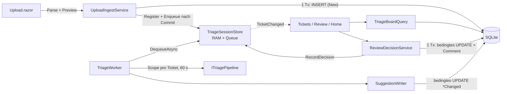

# Plan: web-triage-ui

**Datum**: 2026-09-24 · **Branch**: `feat/web-triage-ui` · **Modus**: `/orchestrate … fast` (≤ 4 h, 3 Slices)
**Grundlage**: [requirements.md](requirements.md) (freigegeben, Commit `1485237`; FR1–FR24, NFR1–NFR8, AC1–AC15) · [architecture.md](../../architecture.md) §4–§5 · [ADR-0002](../../adr/0002-background-analysis-worker.md)

> **Freigegeben** am 2026-09-24 im Plan-Modus (inkl. der Punkte in §0).

## 0. Zur Bestätigung mit dieser Freigabe + Vorbedingungen

1. **Ein leerer Vorschlag löscht nichts** (Auslegung von FR18, siehe Leitplanke 6):
   - Liefert die Pipeline für ein Feld nichts (z.B. die Stub-Pipeline bei Services, Teams und Assignee) oder einen Wert «not in catalog», zeigt das Formular das **Original** mit einem Hinweis. Accept schreibt dann also nicht `null` über das Original.
   - `Resolution` wird nur geschrieben, wenn ein Status gewählt ist.
2. **Format-Check nur auf unseren Pfaden**:
   - `dotnet format --verify-no-changes` scheitert in diesem Checkout an **allen** Dateien. Grund: `core.autocrlf=true`, `.editorconfig` verlangt `end_of_line = lf`, und es gibt kein `.gitattributes` (siehe `format.log`). Das Problem gab es schon vor diesem Feature, und ein Fix läge ausserhalb des Web.
   - Die DoD prüft deshalb mit `--include src/TicketTriage.Web/ tests/TicketTriage.Web.Tests/`.
3. **Vorbedingung `dotnet`**:
   - Das SDK 10.0.401 liegt nur unter `~/.dotnet/dotnet.exe`, **nicht im PATH** (weder Bash noch PowerShell), und `DOTNET_ROOT` ist nicht gesetzt.
   - Alle Kommandos laufen deshalb mit dem Präfix `PATH="$HOME/.dotnet:$PATH" DOTNET_ROOT="$HOME/.dotnet"`.
   - Der Format-Hook `format-csharp.sh` bricht ohne `dotnet` im PATH still ab. Die Formatierung macht deshalb der build-fixer.
   - Empfehlung an dich (einmalig, optional): beide Variablen dauerhaft als User-Umgebungsvariablen setzen.
4. **Baseline vor Slice 1**: `dotnet build` + `dotnet test` auf dem unveränderten Branch müssen grün sein. Sonst stoppe ich und melde es.

## 1. Kontext

Die Web-UI bekommt für die Jury-Demo den Human-in-the-Loop-Ablauf:
- JSON hochladen
- ein Worker im Web analysiert die Tickets, die Ampel wechselt live
- Review mit Accept, Save oder Reject
- Dashboard mit Acceptance-Rate und Durchlaufzeit

Alles liegt in `TicketTriage.Web` und nutzt das heutige Schema (NFR1):
- Vorschläge stehen in den `*Changed`-Spalten.
- Der Entscheid steht in `StatusId`.
- Alles Übrige liegt im RAM: Issue key, Queue, Versuche, Entwurf, Listen, Confidence, Zeitstempel und Edits.

Über die Web-Interfaces lassen sich später die Core-Ports `ITicketIngestor` und `IReviewService` des Teams einsetzen.

## 2. Architektur-Überblick



```
src/TicketTriage.Web/
  Program.cs                      Ä  builder.Services.AddTriageUi(builder.Configuration)
  Triage/                         N  Web-lokale Anwendungsschicht (EF nur hier, nie in .razor)
    TriageUiServiceCollectionExtensions.cs · TicketDisplayState.cs · ReviewField.cs
    TriageVocabulary.cs · TicketPredicates.cs · LookupCatalog.cs · TicketMapper.cs
    TriageWorkQueue.cs · TriageSessionStore.cs · TriageWorker.cs · SuggestionWriter.cs
    UploadParser.cs · UploadIngestService.cs · TriageBoardQuery.cs
    ReviewFormModel.cs · ReviewDecisionService.cs (S2) · SessionMetrics.cs (S3)
  Components/
    Layout/MainLayout.razor Ä · Layout/TriageTheme.cs N · _Imports.razor Ä
    Shared/TrafficLight.razor N · OwnerBadge.razor N (S2) · RejectDialog.razor N (S2)
    Pages/Upload.razor(+.cs) N · Tickets.razor ersetzt · Review.razor(+.cs) ersetzt (S2) · Home.razor Ä (S3)
  wwwroot/app.css                 Ä  Klassen für Ampel, Badges und Abweichungen
tests/TicketTriage.Web.Tests/     N  xUnit v3 + FluentAssertions + bUnit 2.11.3
  Support/  TestDatabase · FakeTriagePipeline · ManualTimeProvider · TriageBunitContext · FakeHealthCheckService (S3)
  Fixtures/challenge-sample.json  20 synthetische Tickets (nicht in data/, das der Hook schützt)
```

| Typ (in `Triage/`) | Verantwortung | DI |
|---|---|---|
| `LookupCatalog` : `ILookupCatalog` | Lädt alle Lookups einmal (Name↔Id, `OrdinalIgnoreCase`), Status-Ids per Name. Fehlt ein Seed-Name, wirft er eine klare Exception. | Singleton |
| `TriageVocabulary`, `TicketPredicates` | Core-Enum ↔ JSON-Name über die Core-Converter, Impact Core↔DB (Kopie von `ImpactNameTranslation` aus `TrainingDataImporter.cs`), `Truncate`. Dazu `HasSuggestion`/`HasNoSuggestion` als EF-Expressions. | static |
| `TicketMapper` | `Ticket` → `TicketEntity` + Hinweise (Importer-Regeln). `TicketEntity` → `Ticket` («Analyse now»). `TriageSuggestion` → `*Changed`-Werte + NotInCatalog. | static, pur |
| `TriageSessionStore` (+ `TriageWorkQueue`) | RAM-Eintrag pro Ticket-Id (immutable Record) und Queue-Reihenfolge unter **einem** Lock. Ein `SemaphoreSlim` zählt die Queue-Einträge. Event `TicketChanged(int)`. | Singleton |
| `TriageWorker` | `BackgroundService`, seriell: Dequeue → Scope → Pipeline (60 s) → Writer → Store | Hosted |
| `SuggestionWriter` : `ISuggestionWriter` | Ein bedingtes `UPDATE` aller `*Changed` | Scoped |
| `UploadParser` | Prüft Grenzen und parst JSON zu Einträgen mit Gültigkeit und Grund | static, pur |
| `UploadIngestService` : `IUploadIngestService` | Preview (Hinweise, Import-Falle; DB-Treffer erst in S3), `SaveAndEnqueueAsync` (1 Tx, danach Register), `EnqueueExistingAsync` (S2) | Scoped |
| `TriageBoardQuery` : `ITriageBoardQuery` | Listenzeilen (DB + RAM → Zustand), Review-Daten, nächstes Pending, Zähler Approved/Rejected | Scoped |
| `ReviewFormModel` | Formularzustand, `Priority` per Matrix, `HasChanges`, `EditedFields`, `Reset` | pro Seite |
| `ReviewDecisionService` : `IReviewDecisionService` | Approve/Reject in 1 Tx, bedingt, danach `RecordDecision` im Store | Scoped |
| `SessionMetrics` | Acceptance rate, Edits pro Feld und Ø-Zeiten aus `Snapshot()` | static, pur |

**Wiederverwendet (nur lesen, nicht ändern)**:
- `PriorityMatrix.Resolve` (`Core/Domain/PriorityMatrix.cs`)
- die Converter der Core-Enums (`Core/Domain/Enums.cs`)
- `Ticket` und `TriageSuggestion` (`Core/Domain/*`)
- `ITriagePipeline` (scoped, heute `StubTriagePipeline`)
- `TriageDbContext` + `IDbContextFactory` (`Infrastructure/Persistence/*`)
- die Mapping-Regeln aus `TrainingDataImporter.cs`, gespiegelt

**Leitplanken**
1. **Zustand** (FR11): `DisplayStateMapper.Derive(dbFacts, ramEntry)` prüft in dieser Reihenfolge:
   - `HumanApproved`/`HumanRejected` → Approved/Rejected
   - `New` ∧ `HasSuggestion` → Pending
   - sonst die RAM-Phase Queued/Analysing/Failed
   - sonst `null` (nicht in Triage)

   `ToReviewDecision()` bildet nur Pending, Approved und Rejected auf Core-`ReviewDecision` ab.
2. **Namen, nie Ordinalwerte**:
   - Jede FK-Id kommt aus dem `LookupCatalog`.
   - Priority = `PriorityMatrix.Resolve` → Core-Name → DB-Id.
   - Impact wird über die duplizierte Tabelle übersetzt (Kommentar «sync mit `TrainingDataImporter`»).
   - Enum-Namen kommen aus den Core-JSON-Convertern (`"Service Request"`, `"No Impact"`, `"Cannot Reproduce"`).
3. **Kurze Transaktionen** (NFR3): Upload = 1 Tx, Vorschlag = 1 `UPDATE`, Entscheid = 1 Tx. Eine Transaktion läuft nie über `TriageAsync`. Eingereiht wird erst nach dem Commit.
4. **Bedingte Writes statt rowVersion**, per `ExecuteUpdateAsync`. EF Core 10 akzeptiert ein normales Lambda `s => { s.SetProperty(…); }`.
   - Writer: `WHERE Id AND StatusId=New AND HasNoSuggestion`
   - Entscheid: `WHERE Id AND StatusId=New AND HasSuggestion`

   Ändert sich 0 Zeilen, heisst das «Already decided» bzw. der Vorschlag wird verworfen. Nichts wird überschrieben (AC10).
5. **HasSuggestion** = mindestens eine der 11 `*Changed`-Spalten ist ≠ null (wie im bisherigen `Tickets.razor`). Der Writer setzt immer `WorkTypeChangedId`. Deshalb bedeutet «hat Vorschlag» immer «analysiert».
6. **Ein leerer Vorschlag löscht nichts** (§0.1):
   - Das Formular startet mit dem Vorschlag.
   - Ist ein Vorschlagswert `null`, steht dort das Original, mit Hinweis «no suggestion – original kept» bzw. «'X' not in catalog».
   - Accept und Save schreiben die Formularwerte.
7. **Prerender** (NFR2):
   - `OnInitializedAsync` und `OnParametersSetAsync` lesen nur die DB. Dass sie doppelt laufen, ist kein Problem.
   - Seiteneffekte laufen nur in `OnAfterRenderAsync` (beim ersten Rendern bzw. bei neuer Id): Abo, `Prioritize`, `MarkOpened`.
   - `Dispose` meldet vom Event ab und bricht die CTS ab.
   - Keine Komponente injiziert `ITriagePipeline`.
8. **Live-Aktualisierung** (FR14, NFR4):
   - Der Store feuert `TicketChanged` ausserhalb des Locks, jeder Handler in try/catch.
   - Die Komponente ruft `_ = InvokeAsync(ReloadAsync)` auf. Läuft schon ein Reload, setzt sie `_dirty` und lädt danach einmal nach.
   - Im Review-Formular lädt die Seite nur neu, wenn das Ticket anderswo entschieden wurde. Sonst gingen die Edits verloren.
9. **Upload-Parsing**:
   - Die Grösse wird geprüft, bevor gelesen wird.
   - `OpenReadStream(maxAllowedSize: 1 MB)`, denn der Default ist 512000.
   - `JsonDocument`, Wurzel muss ein Array mit 1–200 Einträgen sein.
   - Jedes Element wird **einzeln** mit `Deserialize<Ticket>` (`JsonSerializerDefaults.Web`) gelesen. Grund: `Key` und `Summary` sind `required`, sonst würde ein fehlerhafter Eintrag die ganze Datei ungültig machen.
10. **Sicherheit** (NFR5, NFR6):
    - Ticket-Text nur als `@value`, nie als `MarkupString`.
    - Snackbars nennen nur die `#Id`.
    - Logs enthalten nur Ticket-Id, Versuch und Exception-Typ.

**Geprüfte API-Fakten** (MudBlazor 9.10.0 / bUnit 2.11.3 aus dem lokalen NuGet-Cache; wegen `TreatWarningsAsErrors` ist jedes `[Obsolete]` ein Build-Fehler):
- **`MudFileUpload<IBrowserFile>`**
  - Callback: `FilesChanged` mit einem **nullable** Handler `Task OnPicked(IBrowserFile? file)`. Sonst CS8622.
  - Einstellungen: `Accept=".json"`, `DragAndDrop="true"`, optional `MaxFileSize`.
  - Aktivator: `CustomContent` (Kontext = die Komponente → `OpenFilePickerAsync()`). `ActivatorContent` und `ButtonTemplate` gibt es nicht mehr.
  - Obsolete, also verboten: `InputStyle`.
- **`MudDataGrid`**: `RowClick` = `EventCallback<DataGridRowClickEventArgs<T>>` (`.Item`), `PropertyColumn`/`TemplateColumn` (`CellTemplate`, `context.Item`), `RowClassFunc`.
- **Theme**: `new MudTheme { PaletteLight = new PaletteLight { Primary = "#2563eb", Secondary = "#7c3aed", Tertiary = "#d97706" } }`. **Nicht** `new()`, denn der Property-Typ ist das abstrakte `Palette`.
- **Chips**: `MudChipSet<T>` mit `SelectionMode`, `SelectedValue`/`SelectedValueChanged`.
- **Dialoge**:
  - `IDialogService.ShowAsync<T>(title, parameters, options)`.
  - Im Dialog `[CascadingParameter] IMudDialogInstance`, zum Schliessen `Close(DialogResult.Ok(x))`/`Cancel()`.
  - `IDialogReference.Result` ist `Task<DialogResult?>`: auf null prüfen, dann `.Canceled`.
  - `MudDialog.ContentStyle` ist obsolete → `ContentClass`.
- **`ISnackbar.Add(message, Severity)`**.
- **bUnit**: Basisklasse `BunitContext`, rendern mit `Render<T>(…)`. `TestContext` und `RenderComponent` sind obsolete, also Build-Fehler. Für MudBlazor: `Services.AddMudServices(); JSInterop.Mode = JSRuntimeMode.Loose;`, vor Komponenten mit Popover `Render<MudPopoverProvider>()`.
- **xUnit v3**: in Tests `TestContext.Current.CancellationToken` übergeben, sonst bricht die Analyzer-Warnung xUnit1051 den Build.

## 3. Slices

| # | Name | Ziel | ACs | Kompl. | Abh. |
|---|---|---|---|---|---|
| 1 | Upload → Worker → Live-Ampel | Datei hochladen, prüfen und speichern, mit Import-Falle. Der Worker schreibt Vorschläge, die Liste wechselt live grau → blau → gelb. Failed + Re-queue. Theme + Navigation. Testprojekt. | AC1, AC2, AC3, AC5, AC11 | L (~2 h) | – |
| 2 | Review & Entscheid | Original und Vorschlag nebeneinander, Priority wird sofort neu berechnet, Badges. Accept, Save, Reset und Reject werden genau einmal persistiert. Queued öffnen → Ticket nach vorne + Auto-Refresh. «Analyse now». References-Panel. | AC6, AC7, AC8 (RAM), AC9, AC10, AC12, AC14 | L (~1½ h) | 1 |
| 3 | Dedupe & Dashboard | Re-Upload ohne Duplikate, Metriken, Klick auf Zähler filtert die Liste. *Optional, streichbar:* FR24 «New ticket». | AC4, AC8 (Dashboard), AC13, AC15 (Endabnahme) | M (~½ h, FR24 +20 min) | 1; Metriken: 2 |

**FR5 (Import-Falle) ist bewusst in Slice 1**: Lokal fehlt `data/training.json`. Ohne den Schutz würde schon der erste Smoke-Test-Upload den späteren Training-Import dauerhaft blockieren.

Wenn die Zeit knapp wird, in dieser Reihenfolge streichen:
1. FR24
2. Live-Aktualisierung des Dashboards
3. grosse 3-Licht-Ampel (stattdessen Punkt-Variante)
4. bUnit-Test der Upload-Seite

Nie streichen: bedingte Writes, Import-Falle und die AC-Tests.

## 4. Slices im Detail

### 4.0 DoD (für jede Slice)
- `dotnet build TicketTriage.slnx` ohne Warnungen und Fehler
- Alle Tests grün (`dotnet test --solution TicketTriage.slnx`)
- `dotnet format … --verify-no-changes --include src/TicketTriage.Web/ tests/TicketTriage.Web.Tests/` sauber (vorher dasselbe ohne `--verify-no-changes`)
- `git diff main --name-only` enthält nur Pfade aus NFR1
- Smoke-Schritt aus §8 klappt
- Commit `feat(web-triage-ui): <slice>`

### Slice 1 — Upload → Worker → Live-Ampel

**Dateien** (N = neu, Ä = geändert; Pfade relativ zu `src/TicketTriage.Web/`, falls nicht anders angegeben)
- Ä `TicketTriage.slnx`: +1 Zeile unter `/tests/`.
- Ä `Directory.Packages.props`: +`<PackageVersion Include="bunit" Version="2.11.3" />` (liegt im Cache, lib/net10.0).
- N `tests/TicketTriage.Web.Tests/TicketTriage.Web.Tests.csproj`: aufgebaut wie `Core.Tests` (Exe, IsTestProject, xunit.v3, FluentAssertions). Dazu `bunit`, ProjectReference auf Web, `<Using Include="Bunit" />` und `Fixtures\**` mit `CopyToOutputDirectory`.
- N in `Triage/`: alle Dateien aus §2 ausser `ReviewFormModel`, `ReviewDecisionService` und `SessionMetrics`.
  - `UploadIngestService` mit Import-Falle, aber ohne DB-Treffer.
  - `TriageBoardQuery` nur mit `GetRowsAsync`.
- N `Components/Shared/TrafficLight.razor` (Punkt-Variante), `Components/Pages/Upload.razor` + `.razor.cs`, `Components/Layout/TriageTheme.cs`.
- Ä `Program.cs`, `Components/Pages/Tickets.razor` (ersetzt), `MainLayout.razor` (Theme, Navigation Dashboard · Upload · Tickets), `_Imports.razor`, `wwwroot/app.css`.
- N Test-Support:
  - `TestDatabase`: benannte Shared-Cache-In-Memory-DB `Data Source=tt-{guid};Mode=Memory;Cache=Shared` mit Keep-alive-Connection und einer eigenen Connection pro Context. Grund: Der Worker läuft parallel zum Test. Dazu Seed-Helfer und `ConnectionString`.
  - `FakeTriagePipeline`: Aufrufzähler, Verhalten umschaltbar (liefert / wirft / hängt bis Cancel).
  - `ManualTimeProvider`.
  - `TriageBunitContext`.
  - `Fixtures/challenge-sample.json`: 20 Tickets mit echten Lookup-Namen, davon 1× unbekannter Service und 1× Summary > 250 Zeichen.

**Design**
- **Store-API**:
  - `Register(id, issueKey, Ticket, uploadId)`: reiht hinten ein. No-op, wenn das Ticket schon Queued oder Analysing ist.
  - `Prioritize(id)`: zieht das Ticket in der Queue nach vorne.
  - `Requeue(id)`: Failed → Queued, Versuche auf 0.
  - `DequeueAsync(ct)`: → Analysing, Versuch +1, atomar.
  - `CompleteAnalysis(id, suggestion, notInCatalog)`.
  - `FailAttempt(id, reason, max)`: reiht hinten ein, oder Failed.
  - Lesen: `Get`, `Snapshot`, `GetUploadProgress`.
- **Worker**:
  - Pro Ticket `CreateLinkedTokenSource(stoppingToken)` + `CancelAfter(TicketTimeout)`, dann `CreateAsyncScope()`.
  - Aus dem Scope: `ITriagePipeline`, danach `ISuggestionWriter`.
  - `OperationCanceledException` beim Shutdown beendet die Schleife.
  - Jede andere Exception, auch ein Timeout, führt zu `FailAttempt`.
  - `TriageWorkerOptions`: 3 Versuche, 60 s; optional aus der Section `TriageWorker`.
- **Upload-Mapping** wie `TrainingDataImporter`:
  - WorkType per Name, Default Incident; erster Service, erstes Team; Urgency und Priority per Name; Impact übersetzt.
  - Kürzen auf 250/1000/500/50 Zeichen; `CreatedDate = Created?.UtcDateTime ?? now`; leere Kommentare werden verworfen.
  - Abweichung vom Importer: `StatusId` ist **immer New**.
  - Hinweise: gekürzt, unbekannter Wert → leer, «only first service stored».
- **Import-Falle** (FR5):
  - `TrainingDataPresent = Any(StatusId == Finished)`.
  - Fehlt es, zeigt die Seite eine Warnung und eine Checkbox «Save anyway».
  - Ohne Bestätigung liefert `SaveAndEnqueueAsync(preview, confirmedWithoutTrainingData, ct)` `ConfirmationRequired` und schreibt nichts.
- **Dateifehler**: > 1 MB, kein JSON, Wurzel ist kein Array, leer, > 200 Einträge. **Ungültiger Eintrag**: Deserialisierungsfehler, Summary oder Issue key leer, Issue key doppelt.
- **`/tickets`**:
  - `MudChipSet` mit Zustand und Anzahl.
  - `MudDataGrid Items` mit den Spalten:
    - Ampel, #Id, Issue key (sonst «—»), Summary
    - Work type und Priority, bei Pending jeweils der Vorschlag
    - Zustand, bei Failed mit «Re-queue» (`@onclick:stopPropagation`)
  - `RowClick` → `review/{id}`.
  - `MudProgressLinear` «x of n analysed».
  - Zeilen = `HasSuggestion` ∨ entschieden ∨ Id aus der Sitzung.
  - Zwischenstand bis Slice 2: der Zeilenklick öffnet noch das alte Review.
- **`TrafficLight`**:
  - CSS-Klassen `tl-*`: grau `#9ca3af`, blau `#0ea5e9` (pulsierend), rot `#dc2626`, gelb `#facc15`, grün `#16a34a`. Alle klar getrennt vom LLM-Amber `#d97706`.
  - Immer mit Icon und Text: `Schedule`, `Autorenew`, `WarningAmber`, `RateReview`, `CheckCircle`, `Cancel`.

**Tests**
- `UploadParserTests`:
  - Fixture ergibt 20 gültige Einträge (AC1).
  - Dateifehler, ohne die Datei zu lesen: kaputtes JSON, Objekt-Wurzel, leeres Array, > 200 Einträge, > 1 MB (AC3).
  - Eintrag ohne Summary ist ungültig, die übrigen bleiben gültig (AC3).
  - Doppelter Issue key.
- `UploadIngestServiceTests`:
  - Die Preview schreibt nichts (AC1).
  - Save legt nur gültige Einträge als New an, mit Importer-Mapping (Impact, Kürzen, Comments), und registriert sie erst nach dem Commit (FR3).
  - Ohne `Finished` → `ConfirmationRequired`, nichts geschrieben; mit Bestätigung wird gespeichert (AC5).
- `TriageVocabularyTests`: Jeder Wert von WorkType, Urgency, Impact und Priority existiert als DB-Seed-Name. Die Impact-Übersetzung funktioniert in beide Richtungen.
- `TicketMapperTests` / `SuggestionWriterTests` (FR7):
  - Alle `*Changed` werden gesetzt, auch wenn sie dem Original gleichen.
  - Priority kommt aus der Matrix.
  - Ein unbekannter Service ergibt `null` + NotInCatalog.
  - Ein bestehender Vorschlag wird nicht überschrieben.
- `TriageWorkQueueTests` / `TriageSessionStoreTests`: FIFO, MoveToFront, doppeltes Enqueue ist ein No-op, paralleles Register und Dequeue bleiben konsistent (NFR7).
- `TriageWorkerTests` (Fake-Pipeline):
  - Queued → Pending.
  - 3× Exception → Failed, `Calls == 3`, keine `*Changed` (AC11).
  - Ein Timeout zählt als Versuch.
  - Re-queue → Pending (AC11).
  - Ein fehlerhaftes Ticket blockiert das nächste nicht.
- `TriageEndToEndTests`: echte DI (`AddTriageInfrastructure` + `AddTriageUi`, `ValidateScopes` und `ValidateOnBuild`) mit der `StubTriagePipeline`. Die 20 Fixture-Tickets sind in < 10 s Pending (AC2).
- bUnit:
  - `TrafficLightTests`: pro Zustand Klasse + Icon + Text (FR12).
  - `TicketsPageTests`: Die Zeile wechselt ohne Reload Queued → Analysing → Pending (FR14). Failed zeigt «Re-queue» (AC11). Training-Tickets fehlen (FR13).

### Slice 2 — Review & Entscheid

**Dateien**
- N `Triage/ReviewFormModel.cs`, `Triage/ReviewDecisionService.cs`, `Components/Pages/Review.razor.cs`, `Components/Shared/OwnerBadge.razor`, `Components/Shared/RejectDialog.razor`.
- Ä:
  - `Components/Pages/Review.razor` (ersetzt, Route `/review/{Id:int}` bleibt)
  - `TriageBoardQuery` (+`GetReviewAsync`, `GetNextPendingIdAsync`)
  - `UploadIngestService` (+`EnqueueExistingAsync`, Key `#<id>`)
  - `TriageSessionStore` (+`MarkOpened`, `RecordDecision`)
  - `TrafficLight` (+Variante Large mit 3 Lichtern)
  - `AddTriageUi`, `app.css`

**Design**
- **Seitenmodi**, abgeleitet aus DB und RAM:

  | Fall | Anzeige |
  |---|---|
  | Ticket nicht gefunden | Meldung «not found» |
  | `Finished` | read-only, «Not part of triage» |
  | Queued/Analysing | «Agent is analysing…», beim Öffnen `Prioritize` |
  | New ohne Vorschlag, nicht im RAM | «Analyse now» |
  | Failed | Grund + «Re-queue» |
  | Pending | Formular |
  | Approved/Rejected | read-only, mit Reject-Grund, falls im RAM |

- **Links, read-only**: Summary, Description, Comments und die Originalwerte.
- **Rechts, das Formular**:
  - Work type, Service und Team als Selects aus dem Katalog.
  - Assignee (max. 50 Zeichen), Urgency, Impact, Resolution (`ResolutionStatus?`), Comment (max. 500 Zeichen).
  - Priority read-only.
  - Weicht ein Feld vom Original ab, wird es markiert und zeigt «was: X». Weicht nichts ab, erscheint «No changes suggested».
  - Die vollständigen Service- und Team-Listen erscheinen als Chips.
- **Badges** über `ReviewField.Owner()` (FR17):

  | Owner | Felder | Farbe / Fläche |
  |---|---|---|
  | Code | Team, Assignee, Priority | `#2563eb` / `#dbeafe` |
  | LLM | Work type, Service | `#d97706` / `#fef3c7` |
  | LLM+Code | Urgency, Impact, Resolution, Comment | `#7c3aed` / `#ede9fe` |

- **Buttons**:
  - Accept ist nur ohne Änderungen aktiv (`!HasChanges`), Save nur mit (`HasChanges`).
  - Reset setzt das Formular zurück.
  - Reject öffnet den `RejectDialog`: Grund ist Pflicht.
- **Nach dem Entscheid**:
  - Bei `Saved`: Snackbar, dann weiter zum nächsten Pending-Ticket. Gibt es keins, zurück zu `/tickets`.
  - Bei `AlreadyDecided`: Snackbar und Reload.
- **Approve** in 1 Tx:
  - Die Originale erhalten die Formularwerte, `PriorityId` = Matrix.
  - Alle `*Changed` werden `null`, `StatusId` = HumanApproved.
  - Ein nicht leerer Kommentar wird zu einer neuen `CommentEntity`.
  - Danach `RecordDecision(Approved, editedFields)`.
- **Reject**: `*Changed` → null, `StatusId` = HumanRejected. Der Grund bleibt im RAM. Ein leerer Grund wirft eine `ArgumentException`.
- **Laden und Refresh**:
  - Geladen wird in `OnParametersSetAsync`, weil «weiter zum nächsten Ticket» dieselbe Instanz mit neuer Id nutzt.
  - Die Seiteneffekte laufen für jede neue Id erneut.
- **Panel «References & confidence»** (FR21): die Similar keys, sonst «No references». Confidence als `P0`, bei null oder ≤ 0 «—».

**Tests**
- `ReviewFormModelTests`:
  - High × Major = Highest; jede Änderung von Urgency oder Impact rechnet Priority neu (AC6).
  - Accept nur ohne, Save nur mit Änderung; `EditedFields` und Reset (AC8).
  - Ein leerer Vorschlag fällt auf das Original zurück.
- `ReviewDecisionServiceTests` (SQLite):
  - Accept → HumanApproved, Original = Vorschlag, `*Changed` null, `PriorityId` = Matrix, eine Zeile in `Comments` (AC7).
  - Save zählt die Edits pro Feld (AC8).
  - Reject ohne Grund wirft. Mit Grund → HumanRejected, Original unverändert (AC9).
  - Ein zweiter Entscheid → `AlreadyDecided`, die DB bleibt unverändert (AC10).
- bUnit `ReviewPageTests`:
  - Queued-Ticket öffnen → «Agent is analysing…», vorne in der Queue, `Calls == 0`. Nach `CompleteAnalysis` erscheint das Formular ohne Reload, `Calls` bleibt 0 (AC12).
  - Original und Vorschlag stehen nebeneinander, Abweichungen sind markiert (FR15).
  - Edit → Accept aus, Save an (FR18).
  - Badges tragen die Klassen `owner-code`/`owner-llm`/`owner-mixed` (AC14).
  - Approved ist read-only. Finished zeigt «Not part of triage». New ohne Queue zeigt «Analyse now» (FR10, FR20).
  - `<script>` in der Summary wird escaped (NFR5).
- bUnit `RejectDialogTests`: Confirm ist ohne Grund deaktiviert (AC9).

### Slice 3 — Dedupe & Dashboard

**Dateien**
- N `Triage/SessionMetrics.cs`, `tests/.../Support/FakeHealthCheckService.cs`.
- Ä:
  - `UploadIngestService`: DB-Treffer in der Preview und erneut in der Save-Tx.
  - `Upload.razor(.cs)`: Spalte «DB».
  - `TriageBoardQuery`: +`GetDecisionTotalsAsync`.
  - `Home.razor`: Metriken; der Health-Block bleibt.
  - `Tickets.razor`: `[SupplyParameterFromQuery] State`.
- Optional FR24: Tab «New ticket» in `Upload.razor`, auf demselben Weg `SaveAndEnqueueAsync`, Key `MANUAL-<n>`.

**Design**
- **Treffer** (FR4):
  - 1 Query: Kandidaten mit `summaries.Contains(t.Summary)` ∧ `StatusId ≠ Finished`.
  - Im Speicher vergleichen: Description und — falls `Created` gesetzt ist — `CreatedDate`. Verglichen werden die **gekürzten** Werte.
  - Treffer mit Vorschlag oder Entscheid → «already in triage», wird übersprungen.
  - Treffer ohne Vorschlag → neu einreihen, ohne Insert.
  - `Finished`-Tickets (Training) sind nie Duplikate.
- **Dashboard** (FR22):
  - Karten pro Zustand → `/tickets?state=…`.
  - Approval rate aus der DB, «—» bei 0.
  - Aus `SessionMetrics`: Acceptance rate (0 Edits / alle Approved), Edits pro Feld, Ø Upload → erstes Öffnen, Ø erstes Öffnen → Entscheid.
  - Aktualisiert sich über `TicketChanged`. Der Health-Check (LLM-Probe) läuft dabei **nur** beim Laden oder Refresh.

**Tests**
- `UploadIngestServiceTests`:
  - Neustart (neuer Store, gleiche DB) + gleiche Datei → 0 neue Zeilen, Unanalysierte neu eingereiht, Entschiedene «already in triage» (AC4).
  - Ein Treffer auf `Finished` ist kein Duplikat.
- `SessionMetricsTests` (`ManualTimeProvider`): Acceptance rate, Edits pro Feld +1 nach Save (AC8), Ø-Zeiten (AC13).
- bUnit:
  - `HomePageTests`: Zähler, Rates und Edits sind sichtbar; Klick → `/tickets?state=…` (AC13).
  - `TicketsPageTests`: `?state=Failed` filtert (AC13).
  - Optional `UploadPageTests`: `FindComponent<InputFile>().UploadFiles(InputFileContent.CreateFromText(...))`.
- Endabnahme AC15 gemäss §4.0 und §8.

## 5. Migrationen

Keine. NFR1 verbietet Schema-Änderungen:
- Alle persistenten Daten passen in bestehende Spalten (`*Changed`, `StatusId`, `Comments`).
- Der Rest liegt bewusst im RAM (Out of Scope).
- `EnsureCreated` und die Seeds bleiben unberührt.

## 6. Build- und Test-Kommandos

```bash
export PATH="$HOME/.dotnet:$PATH" DOTNET_ROOT="$HOME/.dotnet"   # Präfix pro Shell-Aufruf (§0.3)
dotnet build TicketTriage.slnx
dotnet test --project tests/TicketTriage.Web.Tests/TicketTriage.Web.Tests.csproj   # schnelle Schleife
dotnet test --solution TicketTriage.slnx                                            # MTP: --solution/--project
dotnet format TicketTriage.slnx --include src/TicketTriage.Web/ tests/TicketTriage.Web.Tests/
dotnet format TicketTriage.slnx --verify-no-changes --include src/TicketTriage.Web/ tests/TicketTriage.Web.Tests/
git diff main --name-only
aspire run          # oder: dotnet run --project src/TicketTriage.AppHost
```

## 7. Risiken & Gegenmaßnahmen

| Risiko | Gegenmaßnahme |
|---|---|
| `dotnet` fehlt im PATH, der Format-Hook läuft ins Leere | Präfix aus §0.3 in jedem Kommando. Der build-fixer formatiert explizit. |
| Prerender führt `OnInitializedAsync` doppelt aus | Dort nur DB-Lesezugriffe. Seiteneffekte in `OnAfterRenderAsync`. AC12-Test mit Aufrufzähler. |
| Singleton-Store wird vom Worker und von vielen Circuits gleichzeitig genutzt | Ein Lock, immutable Einträge, Event ausserhalb des Locks, Handler isoliert. Parallel-Test. |
| Lookup-Ordinalwerte ≠ Core-Enums | Nur Namen über den `LookupCatalog`. Guard-Test Core ↔ Seeds. Impact-Tabelle mit Sync-Kommentar. |
| SQLite hat einen einzigen Writer (Batch schreibt evtl. parallel) | 1 Tx pro Aktion, bedingte `UPDATE`s, nie über einen Pipeline-Aufruf. Microsoft.Data.Sqlite wartet bis zu 30 s. |
| Upload in eine leere DB blockiert den Training-Import | FR5 schon in Slice 1. Smoke-Tests nur mit bewusster Bestätigung. |
| Stub-Vorschläge sind leer oder gleich | Leerer Wert fällt auf das Original zurück (Leitplanke 6). Anzeigen «No changes suggested», «No references», Confidence «—». |
| Neustart leert den RAM | Pending und Entschiedene bleiben in der DB. Re-Upload reiht neu ein (AC4), dazu «Analyse now». |
| Ersetzen von `Tickets.razor` und `Review.razor` kollidiert mit Team-Änderungen | Die Routen bleiben. Früh ankündigen, pro Slice committen. |
| MudBlazor 9 hat APIs umbenannt, Obsolete-Member | Geprüfte Fakten aus §2 nutzen. Früh kompilieren. |
| Das Format der challenge.json ist nicht bestätigt | Klare Datei- und Eintragsfehler. Die Fixture ist synthetisch. Bei Bedarf ein lenienter Converter nur im Web-Parser. |
| Tests mit Hintergrund-Worker sind flaky | Shared-Cache-DB mit einer Connection pro Context. Auf den Endzustand warten (TCS über `TicketChanged`), dann `StopAsync`. |

## 8. End-to-end-Verifikation

**Automatisiert**: `dotnet test --solution TicketTriage.slnx`. Alle ACs haben Tests. AC11 und AC12 sind **nur** automatisiert prüfbar.

**Manuell** (Demo-Skript, ~10 min; App via `aspire run` oder `dotnet run --project src/TicketTriage.Web`):
1. Auf `/upload` die Datei `tests/TicketTriage.Web.Tests/Fixtures/challenge-sample.json` ablegen. Erwartet: 20 gültige Zeilen, Hinweise bei den 2 präparierten Tickets, ohne Training-Daten die Warnung + Checkbox, `/tickets` noch leer (AC1, AC5).
2. Eine Datei `{}`, eine Datei ohne JSON und eine > 1 MB hochladen → Fehlermeldung, nichts gespeichert (AC3).
3. «Save & analyse» → `/tickets` wechselt grau → blau → gelb, «20 of 20 analysed» in < 10 s (AC2).
4. Ein Pending-Ticket öffnen: Original und Vorschlag stehen nebeneinander. Urgency High + Impact Major → Priority Highest. Reset, dann Accept → grün, das nächste Ticket öffnet sich (AC6, AC7).
5. Beim nächsten Ticket Assignee ändern → Save wird aktiv → grün. Beim übernächsten ist Reject ohne Grund blockiert, mit Grund → rot (AC8, AC9).
6. Dasselbe Pending-Ticket in zwei Tabs öffnen und in Tab A entscheiden. Tab B wechselt live auf read-only bzw. zeigt «Already decided» (AC10).
7. Auf dem Dashboard prüfen: Zähler, Approval rate und Acceptance rate, Edits pro Feld, Ø-Zeiten. Ein Klick auf «Pending» filtert die Liste (AC13). Theme, Badges und Ampel zeigen die Farben aus FR23 (AC14).
8. App neu starten, dieselbe Datei hochladen → keine neuen Zeilen, Entschiedene «already in triage» (AC4).
9. Mit `git diff main --name-only` prüfen, dass nur Pfade aus NFR1 geändert sind (AC15).

## 9. Ablauf nach Freigabe (orchestrate fast)

1. Diesen Plan als `docs/features/web-triage-ui/plan.md` speichern und committen.
2. Baseline-Build und -Tests (§0.4).
3. Pro Slice (1 → 2 → 3):
   - Agent `implementer` (Slice + Requirements-Abschnitt)
   - Agent `build-fixer` (max. 3 Versuche)
   - Commit `feat(web-triage-ui): …`
4. Review: `code-reviewer` + `security-reviewer` parallel, nur MUST/🔴.
5. `docs-writer`: nur der README-Abschnitt.
6. Phase 7/8 kurz. Kandidaten:
   - CLAUDE.md-Gotchas: `dotnet` nicht im PATH, CRLF/Format, Umbenennungen in MudBlazor 9
   - Korrektur in `blazor-server/SKILL.md`: bUnits `TestContext` ist nur obsolete, nicht entfernt
