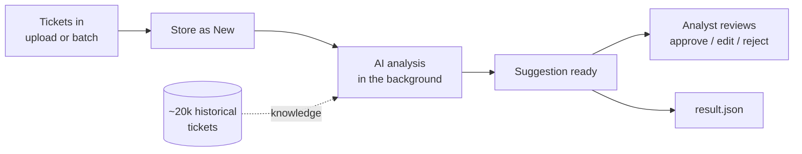

# TriAIge – Application Overview

## What it does

TriAIge helps an IT service desk handle incoming tickets faster. For every new ticket it suggests:

- **what kind of request** it is (work type) and **which IT service** is affected
- **who should handle it** (service team and assignee)
- **how urgent it is** (urgency, impact and the resulting priority)
- **a first answer** (resolution status and a draft comment)

A human analyst always has the last word: they review each suggestion in a web app and approve, edit or reject it.

For the Swiss {ai} Weeks challenge, the same process runs over the 20 challenge tickets and produces `result.json` for scoring.

## How it does it

1. **Learn from history.** About 20,000 past tickets are loaded into a local database. They are used to find similar tickets, to learn which team looks after which service, and to count how much work each person already has.
2. **Take in tickets.** New tickets arrive through the web upload page or the batch run and are saved as *New*.
3. **Analyse in the background.** A worker inside the web app picks up new tickets one at a time and runs them through these steps:
   1. find similar past tickets
   2. let the AI classify the ticket (type, service, urgency, impact); the priority follows from urgency × impact via a fixed table
   3. route it: the team comes from past statistics, the assignee is the person with the least work
   4. let the AI draft a resolution status and comment
   5. check the result; if it is incomplete or wrong, try again
4. **Review.** Analysts see the original ticket next to the suggestion and approve, edit or reject it. Opening a ticket never waits for the AI, because the suggestion is already there.
5. **Export.** As soon as all tickets are analysed, the AI suggestions are written as `result.json`, which has the same shape as the input file. The export does not wait for the review, and analyst edits stay in the app.

## Design principles

- **AI suggests, rules decide.** The AI reads and understands the text. Priority, team and assignee follow fixed rules, so they are predictable and can be explained.
- **Human in the loop.** In the app, nothing is final until an analyst decides. (The scoring export `result.json` is the AI's own answer, not the reviewed one.)
- **Always an answer.** If the AI still fails or times out after a few retries, the system uses a safe default suggestion built from similar tickets and fixed rules, and an analyst reviews it like any other.
- **Choice of AI provider.** Azure OpenAI, OpenAI, Apertus (Swisscom) or a local Ollama model, switched by configuration.

## Building blocks

| Part | Role |
|---|---|
| **Web app** (Blazor) | Dashboard, upload tickets, list and review suggestions, download results. Also hosts the background worker |
| **Batch app** | Hands the challenge file to the database, waits for the web app's worker and writes `result.json` (needs the web app running) |
| **AI agents** | Classification and drafting via the LLM |
| **Database** (SQLite) | Historical tickets, new tickets, suggestions and review decisions |
| **Aspire** | Starts everything together, with a dashboard for logs, traces and health |

More detail: [architecture.md](architecture.md) · [requirements.md](requirements.md) · [README](../README.md)
