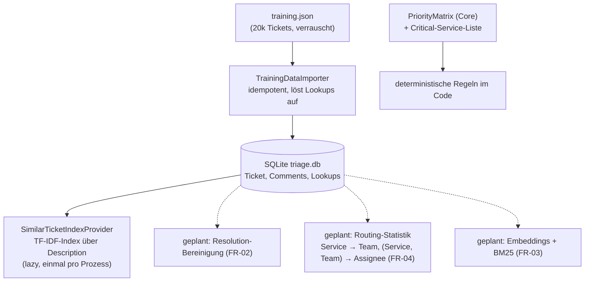
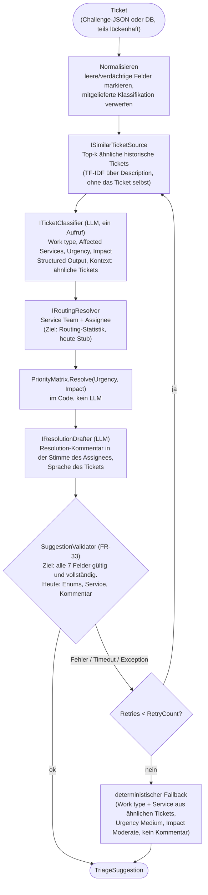

# Architektur: AI Ticket Triage (Swiss AI Weeks Hackathon)

Workflow-Sicht auf die Challenge «AI-Powered Ticket Triage» für die .NET-Anwendung TicketTriage (.NET 10, Microsoft Agent Framework, SQLite, Aspire). Diese Datei erklärt den **Ablauf pro Ticket** und die Modellwahl. Projektstruktur, Diagramme und der Umsetzungsstand je Komponente stehen in [architecture.md](architecture.md), Entscheidungen in [adr/](adr/), Anforderungen in [requirements.md](requirements.md).

> **Umsetzungsstand:** umgesetzt sind Import, Pipeline (Retry, Timeout, Validierung, Fallback), Ähnlichkeitssuche (TF-IDF über `Description`, im Speicher), LLM-Klassifikation und LLM-Resolution-Draft sowie die Priority-Matrix. **Geplant** sind Routing-Statistik (Team/Assignee), Embeddings mit hybrider Suche (Dense + BM25), Bereinigung der Resolutions und die Persistenz der Reviews.

## 1. Datenaufbereitung (einmalig, auf den 20k Trainingsdaten)

**Wichtige Design-Entscheidungen:**

| Aspekt | Entscheidung | Begründung |
|---|---|---|
| Dokumenteinheit | 1 Ticket = 1 Dokument, kein Chunk-Splitting | Tickets sind kurz, Title+Description meist < 500 Tokens, ein Ticket pro Dokument vermeidet Kontextverlust |
| Suchtext | Nur die `Description`, nie die `Summary` | Der Titel ist in den Challenge-Daten bewusst irreführend |
| Retrieval heute | TF-IDF + Cosine-kNN im Speicher, Selbst-Ausschluss per Id | Kein Schema-Change, kein LLM-Aufruf, deterministisch und testbar. Der Port `ISimilarTicketSource` erlaubt später den Tausch |
| Retrieval Ziel | Dense (Embeddings) + BM25 (hybrid) | Tickets enthalten viele exakte Fachbegriffe (Fehlercodes, «SimCorp Dimension», «Rimes»), die BM25 besser trifft, und mehrsprachige Texte (DE/FR/EN), die Embeddings besser verbinden. Noch nicht umgesetzt |
| Priority | **Kein LLM**, deterministische Matrix (`PriorityMatrix.Resolve`) | Die Challenge bewertet mathematische Konsistenz mit Urgency × Impact |
| Team / Assignee | Statistik aus den Trainingsdaten (Mehrheitsentscheid), nie vom LLM erfunden | Deterministisch, keine erfundenen Personen (ADR-0001). Heute liefert `StubRoutingResolver` noch Platzhalter |
| Trainingsfelder Priority / Urgency / Impact | werden **nicht** verwendet | Sind im Trainingsset zufällig |

## 2. Triage-Workflow pro Ticket (`ITriagePipeline`)

Die Pipeline ist eine feste, sequenzielle Abfolge (ADR-0001). Sie ist stream-basiert (`TriageAsync(IAsyncEnumerable<Ticket>)`, ein Vorschlag pro Ticket, in Eingabereihenfolge) und ruft nur Core-Ports auf.

- **Antwortformat des Classifiers:** ein Structured-Output-Aufruf (`RunAsync<T>`) liefert Work type, Services, Urgency und Impact. Ungültige Enum-Werte oder unbekannte Services führen zu einer Exception, die Pipeline zählt das als fehlgeschlagenen Versuch (kein stilles Korrigieren im Agent).
- **Resolution-Status** (`done`, `cancelled`, `clarification`, `cannot reproduce`): **nicht umgesetzt**, folgt in einem späteren Umsetzungszyklus. Der Drafter kann ihn Agents-seitig erzeugen (`IResolutionDraftAgent`), `TriageSuggestion.ResolutionStatus` existiert, bleibt aber immer `null`; `TriageResult` und die Validierung kennen ihn nicht.
- **Keine Confidence, keine Begründung** pro Entscheidung (bewusst nicht benötigt). Der Vorschlag führt nur die Keys der Referenz-Tickets mit.
- Das Review durch den Analysten passiert nachgelagert im Web-UI, nicht als Schleife im Ablauf (siehe [architecture.md §5](architecture.md)).

### Die 7 bewerteten Felder

Das Ergebnis pro Ticket besteht aus genau diesen Feldern (requirements §2). Urgency und Impact sind Zwischenwerte für die Priority und dürfen korrigiert werden (Teilpunkte).

| # | Feld | Bestimmt durch | Stand |
|---|---|---|---|
| 1 | Work type | LLM (`ITicketClassifier`) | umgesetzt |
| 2 | Affected Service | LLM, gegen Service-Katalog geprüft | umgesetzt (Katalog in Core noch mit Platzhaltern) |
| 3 | Service Team(s) | Routing-Statistik (`IRoutingResolver`) | Stub |
| 4 | Assignee | Routing-Statistik (`IRoutingResolver`) | Stub |
| 5 | Priority | Code (`PriorityMatrix`) | umgesetzt |
| 6 | Resolution-Status | LLM-Draft, Code validiert | **nicht umgesetzt** (späterer Zyklus) |
| 7 | Resolution-Kommentar | LLM (`IResolutionDrafter`) | umgesetzt |

Die Validierung (FR-33) muss **alle sieben** Felder prüfen. Der `SuggestionValidator` prüft heute erst Work type, Urgency, Impact, mindestens einen Service und den Kommentar; Team, Assignee, Priority-Konsistenz und Resolution-Status fehlen noch.
- Ticket-Text ist untrusted Input: er steht nur in der User-Nachricht, nie in den Instruktionen.

## 3. Datenmodell (Core-Typen)

Statt eines generischen State-Objekts tragen typisierte Records den Zustand:

| Typ | Inhalt |
|---|---|
| `Ticket` | Rohfelder inkl. optionaler DB-`Id` (nicht im JSON) |
| `SimilarTicket` | ähnliches Ticket + Score, `Key = DB-{Id}`; Urgency, Impact und Priority immer `null` |
| `TicketClassification` | Work type, Affected Services, Urgency, Impact (ohne Priority) |
| `RoutingDecision` | Service Teams, Assignee |
| `TriageSuggestion` | Ergebnis der Pipeline (Work type, Services, Urgency, Impact, Team, Assignee, Kommentar, Referenz-Keys, `ResolutionStatus` immer `null`), `Priority` wird aus Urgency × Impact berechnet. Keine Confidence, keine Begründung |
| `TriageFailure` | ein fehlgeschlagener Versuch (Grund als Code, Exception-Typ, Stack-Frames, kein Ticket-Text) |

Der Ticket-Status ist der DB-Status (`New`, `Reviewing`, `Reviewed`, `HumanRejected`, `HumanApproved`), siehe [architecture.md §5.1](architecture.md).

## 4. Modell-Einsatz

Der Provider ist per Konfiguration umschaltbar (`Llm:Provider`: Azure OpenAI, OpenAI, Apertus oder Ollama, siehe README).

| Schritt | Modell | Grund |
|---|---|---|
| Klassifikation inkl. Urgency/Impact (`LlmTicketClassifier`) | Chat-Modell des konfigurierten Providers, Temperature 0 | Strukturierte Klassifikation, ein Aufruf hält die Latenz unter 15 s (NFR-06) |
| Resolution-Draft (`LlmResolutionDrafter`) | dasselbe Modell | Textqualität zählt direkt ins Scoring («spezifisch statt generisch») |
| Priority, Routing, Retrieval, Validierung | **kein LLM** | deterministische Funktionen |

Kleine lokale Ollama-Modelle (Standard `qwen2.5:1.5b`) sind bei striktem JSON schwach und eignen sich für Entwicklung. Für den bewerteten Lauf empfiehlt sich ein grösseres Modell (Azure OpenAI, OpenAI oder Apertus). Unit-Tests verwenden immer einen Fake-`IChatClient`.

## 5. Kritischer Punkt für die Bewertung

> «Resolution comments that are specific and plausible, not generic filler.»

Der Hebel ist die Qualität der abgerufenen ähnlichen Tickets und ihrer Resolutions: ohne konkretes, ähnliches historisches Ticket erzeugt das LLM zwangsläufig Floskeln («issue fixed»). Deshalb sind die geplanten Ausbaustufen die Bereinigung der Resolutions (FR-02, FR-05) und das hybride Retrieval (FR-03), nicht weiteres Prompt-Tuning.
