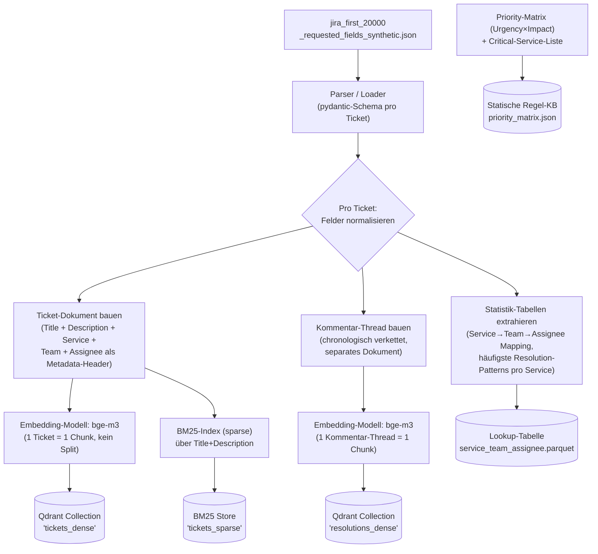
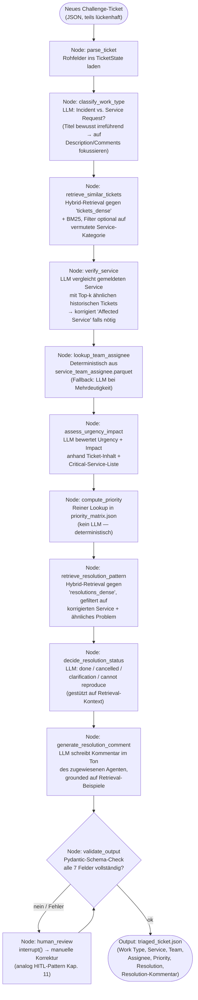

# Architektur: AI Ticket Triage (Swiss AI Weeks Hackathon)

Referenz-Architektur für die Challenge "AI-Powered Ticket Triage", aufbauend auf dem im RunningBot-Capstone validierten Stack (LangGraph, Qdrant, bge-m3, Hybrid-Retrieval).

## 1. Ingestion & Indexing Pipeline (einmalig, auf den 20k Trainingsdaten)



**Wichtige Design-Entscheidungen:**

| Aspekt | Entscheidung | Begründung |
|---|---|---|
| Chunking | **Kein** klassisches Chunk-Splitting pro Ticket | Tickets sind kurz (Title+Description meist < 500 Tokens) → ein Ticket = ein Chunk vermeidet Kontextverlust an künstlichen Chunk-Grenzen |
| Zwei Collections | `tickets_dense` (Problem) getrennt von `resolutions_dense` (Lösung) | Beim Triage brauchst du zuerst "ähnliches Problem", danach separat "wie wurde es gelöst" — unterschiedliche Query-Absicht |
| Embedding-Modell | `bge-m3` | Im Capstone bereits gegen `nomic-embed-text` validiert, mehrsprachig (CH/FR/DE/LUX-Tickets), gute Cross-Lingual-Performance |
| Hybrid Retrieval | Dense (bge-m3) + Sparse (BM25) via EnsembleRetriever | Tickets enthalten viele exakte Fachbegriffe (Fehlercodes, Systemnamen wie "SimCorp Dimension", "Rimes") — BM25 fängt das ab, was Dense-Embeddings "verwässern" |
| Priority | **Kein RAG/LLM**, sondern deterministische Lookup-Tabelle | Ist laut Challenge exakt matrixbasiert — LLM-Einsatz würde nur Fehlerquelle einbauen |
| Service→Team→Assignee | Statistik-Tabelle aus 20k Tickets (Mehrheitsentscheid) + LLM-Fallback bei Unschärfe | Deterministisch wo möglich, LLM nur wenn Mapping in Trainingsdaten uneindeutig ist |

## 2. Triage-Workflow pro neuem Ticket (LangGraph StateGraph)



## 3. State-Objekt (Vorschlag)

```python
class TicketState(TypedDict):
    raw_ticket: dict
    work_type: str | None
    reported_service: str
    verified_service: str | None
    service_team: str | None
    assignee: str | None
    urgency: str | None
    impact: str | None
    priority: str | None          # via Matrix-Lookup, nicht LLM
    retrieved_similar_tickets: list[dict]
    retrieved_resolutions: list[dict]
    resolution_status: str | None  # done | cancelled | clarification | cannot reproduce
    resolution_comment: str | None
    validation_errors: list[str]
```

## 4. Modell-Einsatz (Hackathon-pragmatisch)

| Node | Modell-Empfehlung | Grund |
|---|---|---|
| `classify_work_type`, `verify_service`, `assess_urgency_impact` | lokal via Ollama, z. B. `qwen2.5:7b` | schnell, kostenlos, ausreichend für Klassifikation |
| `generate_resolution_comment` | grösseres Modell (z. B. `gpt-4o-mini` via API) | Textqualität zählt direkt ins Scoring ("spezifisch statt generisch") |
| `compute_priority`, `lookup_team_assignee` | **kein LLM** | deterministische Funktionen |

## 5. Kritischer Punkt für die Bewertung

> "Resolution comments that are specific and plausible, not generic filler."

→ Der `retrieve_resolution_pattern`-Node ist der Hebel: ohne konkret abgerufenes, ähnliches historisches Ticket generiert das LLM zwangsläufig generische Floskeln ("issue fixed"). Retrieval-Qualität hier ist wichtiger als Prompt-Tuning.
